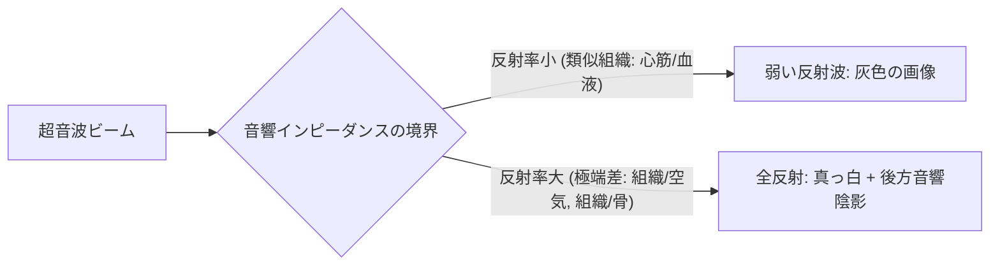

# 超音波の物理と画像化原理

超音波検査を正しく施行し、画質低下の原因を理解するためには、超音波の発生・伝播・反射・屈折および画像の分解能（解像度）に関する物理的原則の理解が不可欠です。

---

## 1. 超音波の基本特性

### 1) 周波数と波長
超音波は音響エネルギーの機械的振動波です。
- **周波数 ($f$)**: 1秒間の振動回数（単位: Hz, 心エコーでは通常 **2.0 〜 5.0 MHz**）。
- **音速 ($c$)**: 生体軟部組織における平均音速は **1,540 m/s**（一定とみなす）。
- **波長 ($\lambda$)**: 音速と周波数の関係式 $\lambda = \frac{c}{f}$ に従います。
  - **周波数が高い ($5.0\text{ MHz}$)** ➔ 波長が短い ➔ **距離分解能が良好** だが **減衰が大きく深達度が低下**。
  - **周波数が低い ($2.0\text{ MHz}$)** ➔ 波長が長い ➔ 分解能は落ちるが **深達度が良好**（肥満・COPD患者用）。

### 2) 音響インピーダンスと反射
超音波画像は、組織間の**音響インピーダンス ($Z = \rho \cdot c$) の差**による反射波（エコー）を検出して作成されます。

- **心筋と血液**: インピーダンス差が小さいため、境界で一部が反射し、一部が透過する（心内膜の描出が可能）。
- **心膜と空気（肺）/骨（肋骨）**: インピーダンス差が極めて大きいため、音波が全反射・全減衰し、その深部は描出不能となる。

---

## 2. 画像の分解能 (Resolution)

心エコーにおける解像度は、以下の3つの独立した要因で構成されます。

> [!IMPORTANT]
> **時間分解能とフレームレートのトレードオフ**
> 心臓は高速で動く臓器であるため、フレームレート (Frame Rate: FR) の維持が極めて重要です。
> - カラー表示範囲（Color Box）を大きく広げたり、Depthを深くしすぎると、1フレームの送信・受信にかかる時間が増加し、FRが低下（15〜20 fpsなど）して動きがカクカクになります。
> - **ストロークや弁の動きを追う際は、FR > 40〜50 fps を維持するように画角とDepthを絞るのがセオリー**です。

---

## 3. ティッシュハーモニックイメージング (THI) の原理

現代の心エコー装置の標準モードである **THI (Tissue Harmonic Imaging)** は、超音波が生体を伝播する際に発生する「歪み（高調波: 第2高調波 $2f$)」を受信して画像化する技術です。

- **基本波 ($f$)**: 浅部での多重反射やサイドローブなどのノイズを多く含む。
- **高調波 ($2f$)**: ビームの中心部（音圧の高い領域）でのみ効率よく発生するため、**サイドローブノイズが激減し、心内膜境界の解像度が劇的に向上**します。
- 肥満患者や描出不良例（Poor acoustic window）において、心内膜の境界や弁尖の微細構造を観察する際の必須機能です。
