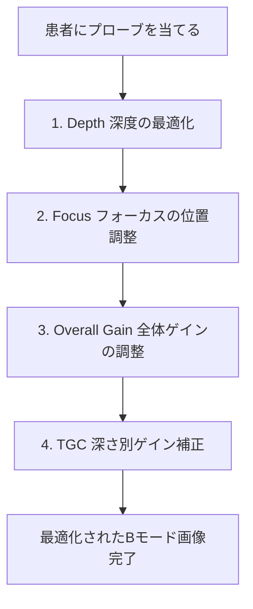

# 装置調整 (Knobology) - Bモード・ドプラの最適化

心エコー検査において、個々の患者の体型・病態に合わせて装置のつまみ（Knob）を迅速かつ最適に調整する技術（Knobology）は、正確な計測と誤診防止の要です。

---

## 1. Bモード (断層像) の最適化手順

### 1) 深度 (Depth) の設定
- **セオリー**: 観察対象の心臓全体が**画面の2/3から3/4の大きさ**で収まる深さに設定します。
- **NG例**: 画面に対して心臓が小さすぎる（Depthが深すぎる）➔ 無駄な深部情報を処理するためフレームレート (FR) が著しく低下します。

### 2) 焦点 (Focus) の設定
- **セオリー**: 超音波ビーム幅が最も細くなるフォーカス位置は、**評価したい構造物（僧帽弁、大動脈弁、あるいは心心尖部）の高さ、またはその直下**に設定します。
- これにより、観察対象における方位分解能（横方向の解像度）が最大化します。

### 3) ゲイン (Overall Gain) と TGC (Time Gain Compensation)
- **Overall Gain**: 全体的な明るさ。心腔内の血液部分がノイズのない「真っ黒 (echo-free)」になり、心筋組織が適度なグレーシェード（輝度）になるよう調整します。
- **TGC (スライドレバー)**: 深さごとの減衰を補正するレバー。
  - 浅部（上側）は減衰が少ないためやや抑えめ、深部（下側）は音波が著しく減衰するため強めに調整し、画面上部から下部まで組織輝度が一定に見える斜めのラインを作ります。

---

## 2. カラードプラの最適化

カラードプラは、血流の平均流速・方向・乱れをカラー表示する機能です。

### 1) カラーボックス (Color Box) のサイズと位置
- **超重要**: **関心領域（観察したい弁やシャント部）に絞って、カラーボックスの幅と高さを最小限に絞ります。**
- カラー表示枠が広いほど、1フレーム内の計算量が膨大になり、フレームレートが10〜15 fpsまで低下して血流の時相評価が困難になります。

### 2) 流速レンジ (Velocity Scale / PRF) の調整
- **心内血流（弁逆流や正常流入）**: ナイキスト限界 (Nyquist limit) を **50 〜 70 cm/s** に設定します。
- **低流速（ASDやVSDの小さな短絡血流、血栓の評価）**: 20 〜 30 cm/s まで下げて微小血流を検出します。
- **高流速（ASやHOCMなどの高速ジェット）**: スケールを限界まで上げてもエイリアシング（モザイク状の反転）が生じるため、評価にはパルスドプラや連続波ドプラを併用します。

### 3) カラーゲイン (Color Gain)
- カラーゲインを上げすぎると、心筋組織上にまでノイズの色（カラーブルーム）が溢れ出ます。
- **調整法**: ノイズが画面に出るまで一度ゲインを上げ、そこからノイズが消える直前までわずかに下げるポイントが最良の設定です。

---

## 3. ドプラ法 (PW/CW) の最適化

| 調整項目 | セオリー | 誤った設定の影響 |
| :--- | :--- | :--- |
| **Sweep Speed (送り速度)** | **50 〜 100 mm/s** に設定 | 25mm/sなど遅すぎると波形が凝縮し、VmaxやVTIのトレース誤差が極めて大きくなる |
| **Baseline (ベースライン)** | 逆流や順行波のピークが見切れない位置に上下移動 | 波形の上端・下端が途切れると正確な最高速度 (Vmax) が計測不能になる |
| **Velocity Scale (スケール)** | 波形が画面縦幅の **2/3 以上** を占める大きさに調整 | 波形が小さすぎるとドプラトレース時の計測精度が著しく低下する |
| **Wall Filter (ウォールフィルター)** | 低周波ノイズ（壁運動に伴うノイズ）を除去 | 高く設定しすぎるとE波やA波の基部（基線付近）が欠損し、DcTなどが誤計測される |

> [!WARNING]
> **心エコーにおける入射角度 (Angle Correction) の原則**
> 腹部エコー等と異なり、心エコーのドプラ計測では **角度補正機能 (Angle Correction) は原則使用しません**。
> 超音波ビームが血流ベクトルと平行（角度 $0^\circ$ または $180^\circ$）になるよう、プローブの当てる角度・位置（ウィンドウ）自体を手動で変更・最適化することが鉄則です。
> （$\cos 0^\circ = 1$ で流速が正確に求まり、角度が $20^\circ$ を超えると速度が過小評価されます）。
