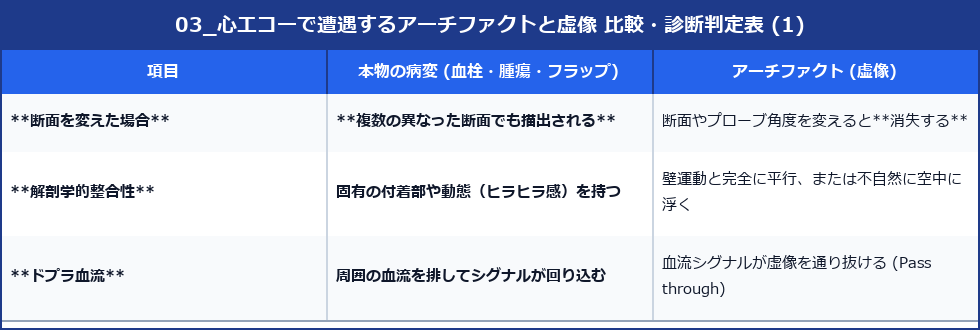

# 心エコーで遭遇するアーチファクトと虚像

超音波の物理的挙動によって発生する「実際の解剖には存在しない画像上の構造・欠損（アーチファクト）」を正しく認識することは、誤診を回避するために極めて重要です。

---

## 1. 代表的なアーチファクトのメカニズムと鑑別法

### 1) 多重反射 (Reverberation)
- **メカニズム**: 超音波ビームが強固な反射体（人工弁、心膜、探触子表面など）とプローブとの間を何度も往復することで生じます。
- **像の特徴**: 元の構造物の深部（遠位）に向かって、等間隔に並ぶ線状・帯状のエコーとして描出されます。
- **臨床で問題となる例**: 
  - 傍胸骨長軸断面で、上行大動脈内に現れる多重反射 ➔ **大動脈解離の内膜フラップ (Intimal flap) と誤認されやすい**。
- **鑑別法**: 
  - 多重反射は、大動脈前壁・後壁の動きと**完全に同期（平行に連動）**して動きます。
  - 一方、本物の解離フラップは心周期に合わせて独自のヒラヒラした動き (Undulating motion) を示します。

```
【多重反射の伝播メカニズム】
プローブ ───> 反射体(強い) ───> プローブ(再反射) ───> 反射体
  └─────────── 往復時間2倍 ➔ 画面上は2倍の深さに虚像描出 ────────────┘
```

---

### 2) 音響陰影 (Acoustic Shadowing)
- **メカニズム**: 石灰化組織や人工弁（機械弁・生体弁のリング）、肋骨などの極めて強い反射体・吸収体の深部へ超音波が伝播せず、後ろが真っ黒な帯状の無エコー領域となる現象。
- **臨床で問題となる例**:
  - 重症僧帽弁輪石灰化 (MAC) や機械弁の深部が陰影となり、**左房内の僧帽弁逆流 (MR) ジェットや血栓が見えなくなる（ブラインドエリアの発生）**。
- **対策**:
  - 1つの断面に頼らず、心尖部4腔、2腔、3腔、胸骨上窩、経食道エコー (TEE) など、**アプローチ角度を変えて陰影の陰に隠れた部位を多角的に観察**します。

---

### 3) サイドローブ・アーチファクト (Side Lobe Artifact)
- **メカニズム**: メインの超音波ビーム（主極）の周囲に放射される副次的な弱いビーム（サイドローブ）が強い反射体に当たり、その反射波を「メインビームから戻ってきた」と装置が判定して描出する現象。
- **像の特徴**: 心房内や心室内など、本来は何もない低エコー腔内にモヤモヤした円弧状・線状の虚像が出現します。
- **鑑別法**: 
  - 心内血栓や腫瘍と誤認されやすいが、プローブの角度を少し傾ける（傾斜操作）と消失するのが特徴です。

---

### 4) エコードロップアウト (Echo Drop-out)
- **メカニズム**: 超音波ビームが構造物の壁面に対して**「平行」**に入射した場合、反射波がプローブに戻らず全反射で側方に逃げるため、壁が存在するのに欠損して見える現象。
- **臨床で問題となる例**:
  - 心尖部4腔断面における心房中隔の中央部（卵円窩）のエコードロップアウト ➔ **心房中隔欠損症 (ASD) との誤認**。
- **対策**:
  - 超音波ビームが心房中隔に対して**垂直**に入射する **剣状突起下アプローチ (Subcostal view)** から観察し、欠損孔の断端にT-artifact（増強効果）があるか、カラードプラで左右短絡血流があるかを確認します。

---

### 5) 鏡像アーチファクト (Mirror Image Artifact)
- **メカニズム**: 横隔膜や心膜などの強い鏡面反射体に超音波が斜めに入射し、反射した音波が近くの構造物（左室など）に当たって戻ることで、鏡面（横隔膜）の奥（肺側）にもう一つの同形の構造物が描出される現象。
- **臨床例**: 左室後壁の奥の胸膜側に、二重の左室像（ミラーイメージ）が見える。

---

## 2. アーチファクトと病変の鑑別チェックリスト




