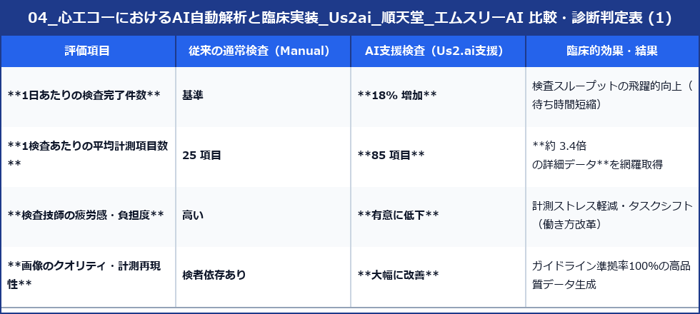
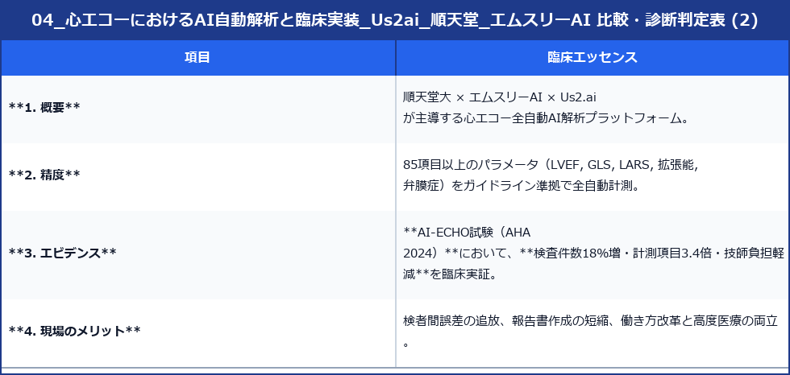

# 心エコーにおけるAI自動解析と臨床実装（Us2.ai / 順天堂大学 / エムスリーAI）

近年、心臓超音波検査（心エコー）の現場では、**人工知能（AI）による画像全自動解析技術**が急速に臨床実装されています。
本ページでは、日本国内で先駆的に推進されている**順天堂大学 × エムスリーAI × Us2.ai（シンガポール）**の共同取り組みと、世界的なエビデンスとなった**AI-ECHO試験（AHA 2024 Late-Breaking Science）**の知見を体系的に解説します。

---

## 1. 医療課題と三者協業のスキーム

心臓超音波検査は心疾患診断の第一選択ですが、**「検者の熟練度に依存する」「計測項目が多く検査時間がかかる」「超音波検査技師の不足と過重労働」**が全国的な課題となっています。

これらを解決するため、以下の三者による産学・グローバル連携スキームが構築されました。

```
┌─────────────────────────────────────────────────────────┐
│               Us2.ai（シンガポール MedTech）             │
│   全自動心エコーAI解析アルゴリズムの開発（FDA認証/PMDA承認）   │
└────────────────────────────┬────────────────────────────┘
                             │ (共同開発・日本仕様最適化)
                             ▼
┌─────────────────────────────────────────────────────────┐
│                 順天堂大学（循環器内科）                  │
│  臨床エビデンス構築（AI-ECHO RCT試験）/ 日本市場向け監修・検証   │
└────────────────────────────┬────────────────────────────┘
                             │ (医療AIプラットフォーム展開)
                             ▼
┌─────────────────────────────────────────────────────────┐
│                    エムスリーAI（M3 AI）                  │
│    全国医療機関への医療機器導入・PACS連携・ワークフロー構築    │
└─────────────────────────────────────────────────────────┘
```

---

## 2. 全自動心エコー解析ソフトウェア「Us2.ai」の特長

「Us2.ai」は、2D Bモード、カラー/パルス/組織ドプラ画像をディープラーニング技術を用いて即座に全自動解析するAIシステムです。

### 1. 超圧倒的な自動計測項目数（85項目以上）
- **従来の手動計測**: 1検査あたり平均 **25項目** 程度（時間的制約のため主要項目のみ）。
- **Us2.ai 自動計測**: ガイドライン（ASE / EACVI / JCS）準拠の **85項目以上**（左室容積、LVEF Biplane, GLS, LARS, 拡張能指標 e'/E/e', LAVi, 弁口面積など）を**完全全自動で数秒〜数分で抽出**。

### 2. 検者間誤差（Observer Variability）の解消
- トレース描出やドプラ波形計測の再現性が極めて高く、検者の熟練度（ベテラン vs 初心者）や体調による計測のブレを排除し、**均一で高度な検査品質**を担保。

### 3. 多彩な心機能・構造評価の一括算出
- **収縮能**: LVEF（Simpson法）、GLS（Global Longitudinal Strain）の自動化。
- **拡張能 (ASE 2025)**: LARS（左房リザーバーストレイン）、e'、E/e'、LAViの自動計測とグレード分類。
- **右心・弁膜症**: TAPSE, RV FAC, 弁口面積・流速の自動トラッキング。

---

## 3. 世界的エビデンス：AI-ECHO試験（AHA 2024 Late-Breaking Science）

順天堂大学（南野徹教授、鍵山暢之准教授ら）とエムスリーAIが実施したランダム化比較試験（RCT）**「AI-ECHO試験」**は、北米心臓協会（AHA 2024）の最重要演題（Late-Breaking Science）に採択され、世界中で大きな注目を集めました。

### ■ 主な研究成果と臨床インパクト





> [!IMPORTANT]
> **本試験が証明した革新性**
> 計測項目数を3.4倍に増やしてより精密なデータを得ているにもかかわらず、**AIの自動計測補助により検査時間は短縮し、技師の疲労度が低下した**という点が、医療現場の「働き方改革」と「医療の質向上」を両立する客観的証拠として高く評価されました。

---

## 4. 臨床における具体的なワークフローと未来の心エコー

### 1. 検査中のリアルタイム支援
- 超音波装置から出力された画像データがPACS/クラウドに転送されると同時に、Us2.aiが自動的に標準断面を判別。
- 左室心筋輪郭やドプラ波形の自動トレース・自動計測結果を数秒でレポート下書きとして自動生成。

2. 検査技師・医師の役割変化（タスクシフト）
- **従来の業務**: 「ひたすら手動で点打ち・トレース・数値入力する」
- **AI導入後の業務**: 「AIが生成した85項目の自動計測値を**確認・承認（Validation）**し、解剖学的異常や微細病変の観察・患者対話に集中する」

3. 心不全・心筋症の早期スクリーニング
- 人手では計測が難しかった **LARS（左房ストレイン）** や **GLS（左室グローバルストレイン）** が全例で自動算出されるため、**HFpEF（無症候性左室拡張障害）や初期の心アミロイドーシス・心筋症の早期発見**が日常診療で可能となります。

---

## 5. 臨床で押さえるべきポイントまとめ




