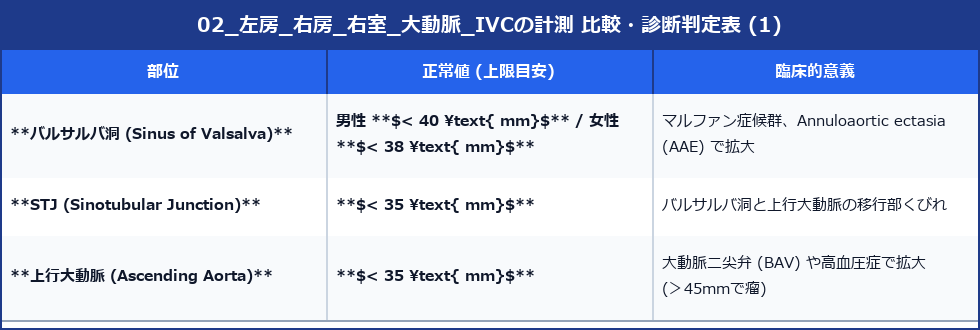
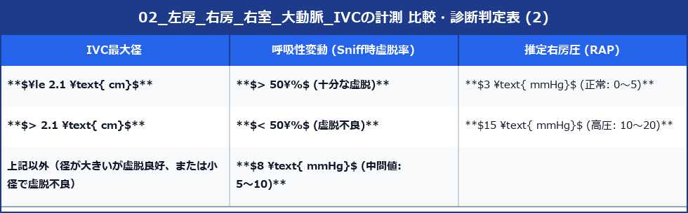

# 左房・右房・右室・大動脈・IVCの基本計測

左室以外の心腔（左房・右房・右室）および大血管（大動脈・下大静脈）の正確な寸法・容積計測は、心不全、弁膜症、肺高血圧症、大動脈疾患の診断と重症度分類において必須の項目です。

---

## 1. 左房 (Left Atrium: LA) の計測

左房の拡大は、左室拡張末期圧 (LVEDP) の持続的上昇や左室拡張能障害の慢性的な負担を反映する重要な指標です。

### 1) 左房前後径 (LAD: LA Diameter)
- **断面**: 傍胸骨左室長軸断面 (PLAX)
- **タイミング**: 左室収縮末期（大動脈弁閉鎖直前、左房容積が最大となる時相）
- **方法**: 大動脈基部レベルにおいて、大動脈後壁の Leading edge から左房後壁の Leading edge まで垂直に計測します。
- **正常値**: 男性 **30 〜 40 mm** / 女性 **27 〜 38 mm**

### 2) 左房容積係数 (LAVI: LA Volume Index) ★ガイドライン推奨
> [!IMPORTANT]
> 左房は非対称性に拡大するため、1次元の前後径 (LAD) ではなく、**2D Biplane Simpson法（バイプレーン法）による容積係数 (LAVI)** で評価することがガイドラインで強く推奨されています。

- **断面**: 心尖部4腔断面 (AP4) および 心尖部2腔断面 (AP2) の両方
- **タイミング**: 左室収縮末期（僧帽弁開放直前の最大時相）
- **トレース手順**:
  1. 僧帽弁輪の左右（または前後）のヒンジポイントを結ぶ直線を引き、心内膜面に沿って左房天井までトレースします。
  2. **肺静脈開口部** および **左心耳** は左房内腔から**除外**してトレースします。
- **算出**: `LAVI = Biplane Left Atrial Volume / 体表面積 (BSA)`
- **判定基準**:
  - 正常: **$\le 34 \text{ mL/m}^2$**
  - 軽度拡大: $35 \sim 41 \text{ mL/m}^2$
  - 中等度拡大: $42 \sim 48 \text{ mL/m}^2$
  - 高度拡大: **$> 48 \text{ mL/m}^2$**

---

## 2. 右房 (Right Atrium: RA) の計測

- **断面**: 心尖部4腔断面 (AP4)
- **タイミング**: 心室収縮末期（三尖弁開放直前の最大時相）
- **右房面積 (RA Area)**:
  - 三尖弁輪部を結ぶラインから、右房心内膜に沿ってトレースします（上大静脈・下大静脈・右心耳の開口部は除外）。
  - **正常値**: **$\le 18 \text{ cm}^2$**

---

## 3. 右室 (Right Ventricle: RV) の計測

右室は複雑な三日月型をしているため、**右室強調心尖部4腔断面 (RV-focused AP4)** から以下の3つの部位を計測します。

```
【右室強調4腔断面における右室計測部位】
          心尖部 (Apex)
           /        \
          /   長軸径  \
         /  (Longitudinal)
        /   中間部径   \
       /    (Mid RV)    \
      /     基部径       \
     └───── (Basal RV) ───┘
```

- **計測部位とカットオフ値 (拡張末期)**:
  1. **右室基部径 (RV Basal)**: 三尖弁輪直下の最大横径 ➔ 正常 **$25 \sim 41 \text{ mm}$** （$\ge 42\text{mm}$ で拡大）
  2. **右室中間部径 (RV Mid)**: 乳頭筋レベルでの横径 ➔ 正常 **$19 \sim 35 \text{ mm}$**
  3. **右室長軸径 (RV Longitudinal)**: 三尖弁輪中点から右室心尖部までの距離 ➔ 正常 **$59 \sim 86 \text{ mm}$**

---

## 4. 大動脈 (Aorta) 各部位の計測

- **断面**: 傍胸骨左室長軸断面 (PLAX)
- **タイミング**: 拡張末期（Q波開始時）※バルサルバ洞は収縮期最大径をとる基準もあります。
- **2D計測**: 前壁内膜〜後壁内膜（Inner-to-inner）または Leading-edge で統一して計測します。





---

## 5. 下大静脈 (IVC) の計測と右房圧 (RAP) の推定

- **断面**: 剣状突起下（心窩部）縦断像
- **計測位置**: 右房・下大静脈接合部から **$1.0 \sim 2.0 \text{ cm}$ 抹消**の位置で、血管長軸に垂直に最大径を計測。
- **呼吸性変動**: 患者に鼻から軽く息を吸ってもらい（Sniffテスト）、IVCの虚脱率を観察します。

### 右房圧 (RAP) 推定ガイドライン (ASE 2015)




