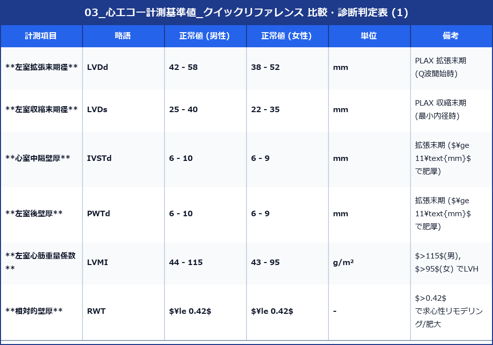
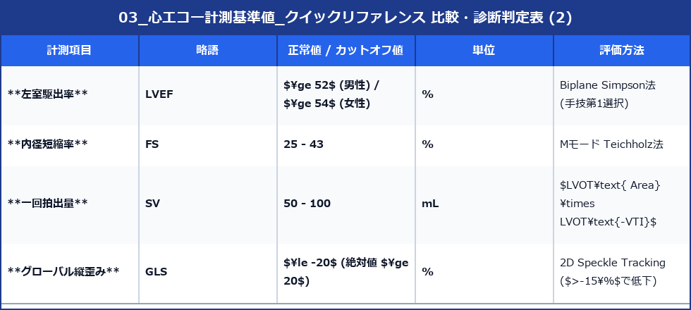
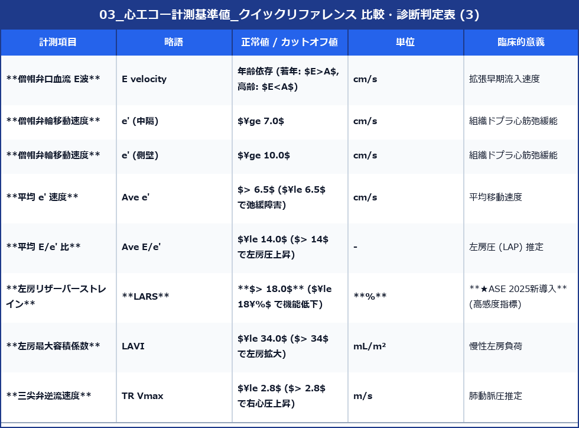
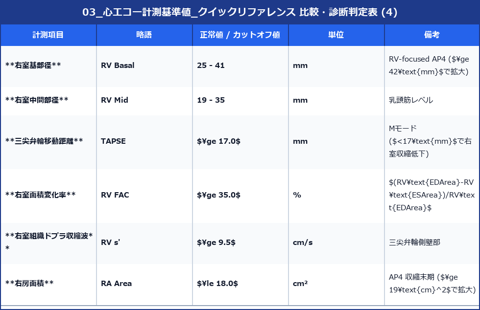
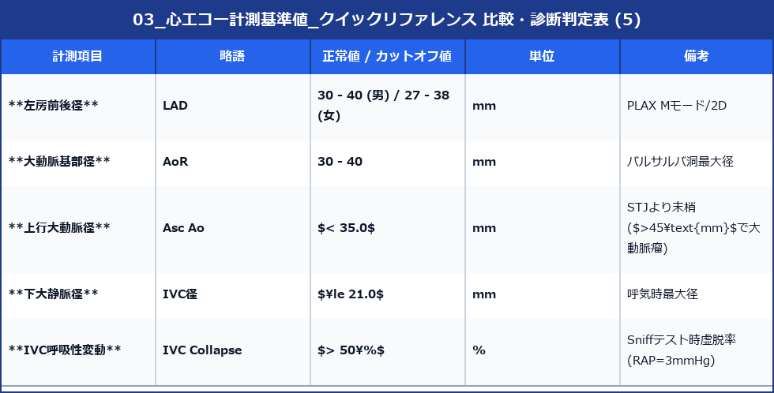

# 心エコー計測基準値 クイックリファレンス

日常臨床・実務で頻用する心エコー計測項目の正常値・カットオフ値一覧です。（主に ASE/EACVI 2015 Chamber Quantification および ASE 2025 Diastolic Function Guidelines に準拠）

---

## 1. 左室 (Left Ventricle: LV)

### 内径・壁厚 (2D / Mモード)

### 収縮能 (Systolic Function)

### 拡張能 (Diastolic Function: ASE 2025最新)

---

## 2. 右室・右房 (Right Ventricle & Atrium)

---

## 3. 大動脈・下大静脈 (Aorta & IVC)

