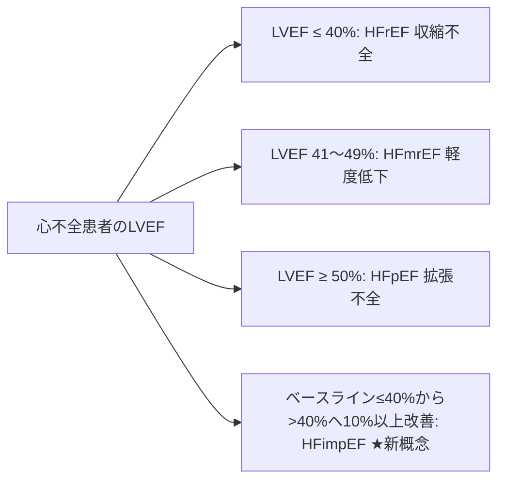

# 左室収縮能の評価 (LVEF, FS, Biplane Simpson法, SV)

左室のポンプレベル（収縮機能）の評価は、あらゆる心不全や心疾患の診断・治療方針決定・予後予測において中心的役割を果たします。

---

## 1. 2D Biplane Simpson法 (改訂Disk法) ★推奨第1選択

ASE/EACVIガイドラインにおいて、左室容積および LVEF 算出力の第一選択として強く推奨されている計測法です。心尖部4腔像 (AP4) と 2腔像 (AP2) の2断面から、左室を多数の円板 (Disks) に分割して容積を計算します。

```
【Biplane Simpson法のディスク分割概念】
   心尖部 (Apex)
      /───\       Disk 1
     /─────\      Disk 2
    /───────\     ...
   /─────────\    Disk 20
  └─ 弁輪部 ─┘
```

### 1) トレース手順と計測タイミング
- **拡張末期 (End-Diastole: ED)**: 心電図Q波開始時または僧帽弁閉鎖直前の最大容量フレーム。
- **収縮末期 (End-Systole: ES)**: 僧帽弁開放直前または左室径最小のフレーム。
- **トレースルール**:
  - 心尖部4腔 (AP4) および 2腔 (AP2) の両方で、心内膜面に沿ってトレースします。
  - **心筋肉柱 (Trabeculations) および乳頭筋 (Papillary muscles) は心腔内（容積の中）に含めてトレース**します（内膜の滑らかな壁面に沿って線を引く）。

### 2) 算出される項目と基準値

$$\text{LVEF (\%)} = \frac{\text{LVEDV} - \text{LVESV}}{\text{LVEDV}} \times 100$$

| 計測項目 | 略語 | 男性正常値 | 女性正常値 | 単位 |
| :--- | :--- | :--- | :--- | :--- |
| **拡張末期容積** | LVEDV | $62 \sim 150$ | $46 \sim 106$ | mL |
| **拡張末期容積係数** | LVEDVI | $35 \sim 75$ | $29 \sim 61$ | mL/m² |
| **収縮末期容積** | LVESV | $21 \sim 61$ | $14 \sim 42$ | mL |
| **収縮末期容積係数** | LVESVI | $12 \sim 30$ | $8 \sim 24$ | mL/m² |
| **左室駆出率** | **LVEF** | **$\ge 52$** | **$\ge 54$** | **%** |

---

## 2. その他の左室収縮能指標

### 1) Mモード Teichholz (タイヒホルツ) 法
- **方法**: PLAXのMモード像で LVDd と LVDs を計測し、球体モデル式 $V = \frac{7.0}{2.4 + D} \times D^3$ を用いて容積とEFを算出します。
- **注意点**: 左室が対称的に収縮している場合のみ有効。**心筋梗塞やLBBBなどの局所壁運動異常 (RWMA) がある場合は著しい誤算が生じるため使用禁止**です。

### 2) 内径短縮率 (FS: Fractional Shortening)
$$\text{FS (\%)} = \frac{\text{LVDd} - \text{LVDs}}{\text{LVDd}} \times 100$$
- **正常値**: **$25 \sim 43\%$** （Mモードでの簡易指標）。

### 3) 一回拍出量 (SV: Stroke Volume) と 心拍出量 (CO: Cardiac Output)
左室流出路 (LVOT) のドプラ法から幾何学的に真のSVを求める高精度な方法です。

$$LVOT\text{ Area (cm}^2) = \pi \times \left( \frac{LVOT\text{ diameter}}{2} \right)^2$$
$$SV\text{ (mL)} = LVOT\text{ Area} \times LVOT\text{-VTI (cm)}$$
$$CO\text{ (L/min)} = \frac{SV \times \text{心拍数 (HR)}}{1000}$$

- **LVOT径の計測**: PLAXの収縮中期に、大動脈弁輪の直下 $0.5 \sim 1.0\text{ cm}$ の位置で内膜〜内膜を正確に計測します。
- **LVOT-VTIの計測**: AP5またはAP3から、LVOTにサンプルボリューム（1.5〜3mm）を置き、PWドプラで収縮期波形の輪郭をトレース（速度時間積分 VTI）します。正常値: **$18 \sim 22\text{ cm}$**。

---

## 3. 最新ガイドラインにおける心不全LVEF分類 (JCS 2025)

2025年3月発表の『JCS/日本心不全学会 心不全診療ガイドライン』による最新の病態分類です。



- **HFrEF**: LVEF $\le 40\%$ (収縮不全主体)
- **HFmrEF**: LVEF $41 \sim 49\%$ (軽度低下)
- **HFpEF**: LVEF $\ge 50\%$ (拡張障害主体)
- **HFimpEF (HF with Improved EF)**: ★JCS 2025最新
  - ベースラインLVEF $\le 40\%$ であった患者が、治療によりLVEFが10%以上向上し、かつ **LVEF $> 40\%$ へ回復した状態**。
  - **臨床上の注意**: LVEFが改善しても心筋の病理学的異常は残存しているため、治療薬の安易な中止は禁忌であり、エコーによる継続的なLVEF監視が必要です。
