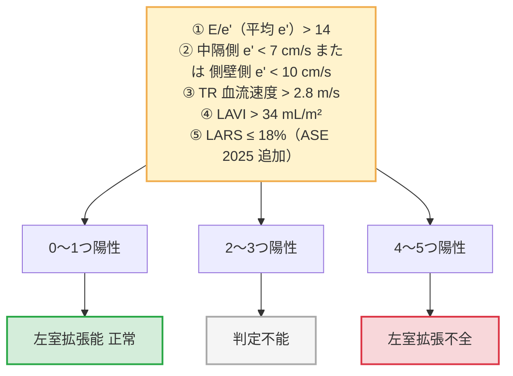
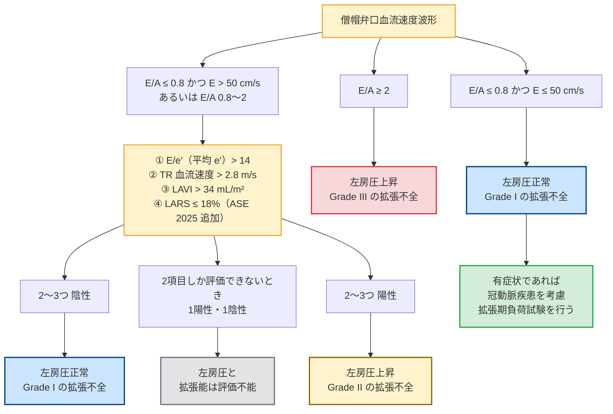

# 左室拡張能の評価アルゴリズム (ASE 2025 LARS対応)

臨床現場で迷わず数秒で判定できるよう、**ASE 2025年最新ガイドライン準拠のカスケード式フロー**で整理しています。

---

## 判定に用いる指標とカットオフ値

| 指標 | カットオフ | 意味 |
| :--- | :--- | :--- |
| 中隔側 e' | < 7 cm/s | 心筋弛緩障害 |
| 側壁側 e' | < 10 cm/s | 心筋弛緩障害 |
| 平均 E/e' 比 | > 14.0 | 左房圧上昇 |
| **LARS** (ASE2025新導入) | **≤ 18.0 %** | 左房機能低下 |
| LAVI | > 34 mL/m² | 慢性左房圧負荷 |
| TR Vmax | > 2.8 m/s | 肺動脈圧上昇 |

---

## カスケード A ── LVEF が正常の場合の左室拡張不全の診断

> [!IMPORTANT]
> **ASE 2025 改訂ポイント**
> LARS（≤ 18%）が第5の指標として追加された。これにより従来「判定不能」だった症例の多くが確定診断できるようになった。

---

## カスケード B ── LVEF 低下例 と 拡張不全確定例における左房圧・重症度の評価

---

## 臨床で3秒で判断するまとめ

| 患者パターン | 使うカスケード | 結論の出し方 |
| :--- | :--- | :--- |
| LVEF正常・呼吸困難（HFpEF疑い） | カスケード A | 5指標中4〜5個陽性 → 拡張不全確定 |
| LVEF低下の心不全（HFrEF） | カスケード B | E/A ≥ 2 → 即 Grade III。中間なら3〜4指標中2個以上陽性 → Grade II |

> [!WARNING]
> **特殊病態での注意点**
> - **心房細動（Af）**: A波がないためE/A評価不可。E/e' > 14・LARS ≤ 18%・TR Vmax > 2.8 m/s の3指標で判断。
> - **重症 MR**: E波が偽高値となりE/e'が過大評価されるため、**LARS** を優先して評価する。
> - **僧帽弁輪石灰化（MAC）**: 弁輪の機械的拘束でe'が低下するため、E/e'は過大評価されやすい。
