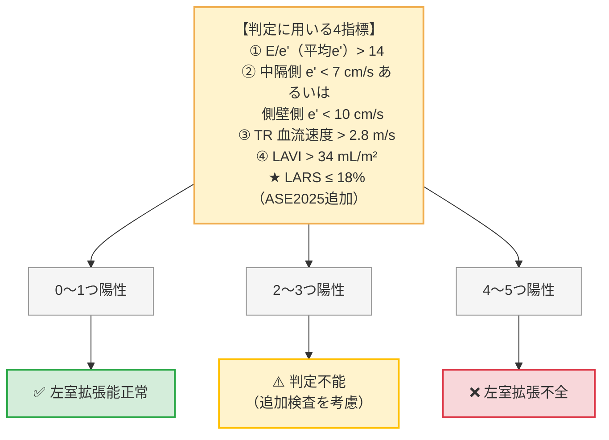
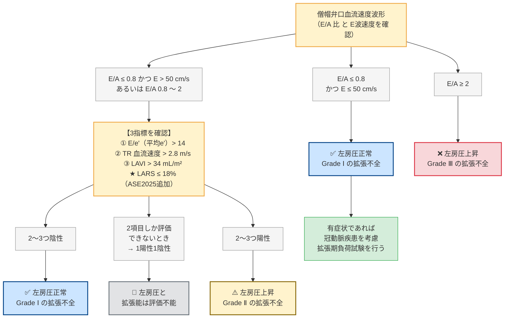

# 左室拡張能の評価アルゴリズム (ASE 2025 LARS対応)

本ページでは、臨床現場で迷わず数秒で左室拡張能障害（Diastolic Dysfunction）および左房圧（LAP）上昇を判定できるよう、**ASE 2025年最新ガイドラインに準拠した「カスケード式（段階的分岐）フロー」** で整理しています。

---

## 1. 判定に用いる指標とカットオフ値

まず以下の計測項目を確認します。

| 指標 | カットオフ値 | 意味 |
| :--- | :--- | :--- |
| **中隔側 e'** | $< 7$ cm/s | 心筋弛緩障害 |
| **側壁側 e'** | $< 10$ cm/s | 心筋弛緩障害 |
| **平均 E/e' 比** | $> 14.0$ | 左房圧上昇 |
| **★ LARS** (ASE 2025新導入) | $\le 18.0$ % | 左房機能低下 |
| **LAVI** | $> 34$ mL/m² | 慢性左房圧負荷 |
| **TR Vmax** | $> 2.8$ m/s | 肺動脈圧上昇 |
| **E/A 比** | $\le 0.8$ または $\ge 2.0$ | 充満パターン異常 |

---

## 2. ■ LVEF が正常の場合の左室拡張不全の診断 (カスケード A)

> [!IMPORTANT]
> **★ ASE 2025年改訂のポイント**
> ASE 2016では4指標だったが、**LARS ($\le 18\%$) が第5の指標として追加** された。
> LARS陽性が加わることで、従来「判定不能」だった症例の多くが「拡張不全」と確定診断できるようになった。

---

## 3. ■ LVEF 低下例と LVEF 正常の拡張不全例における左房圧と重症度の評価 (カスケード B)

---

## 4. 判定指標のポイントまとめ

> [!TIP]
> **LARS (左房リザーバーストレイン) とは？**
> 左房が収縮期に伸びる最大の割合（%）を 2D Speckle Tracking で計測したもの。
> 正常は **$> 18\%$**。$\le 18\%$ は左房コンプライアンスの低下＝左房圧上昇を強く示唆。
> E/e' が「中間値」で判断に迷うとき、LARSが最も鋭敏に左房圧を反映する。

> [!WARNING]
> **特殊病態での注意点**
> - **心房細動 (Af)**: A波が消失するため E/A 評価不可。E/e'・LARS・TR Vmax の3指標で判断。
> - **重症 MR**: E波が偽高値になりE/e'が過大評価されるため、**LARS** を優先して評価する。
> - **僧帽弁輪石灰化 (MAC)**: 弁輪の機械的拘束でe'が低下するため、E/e'が過大評価されやすい。
