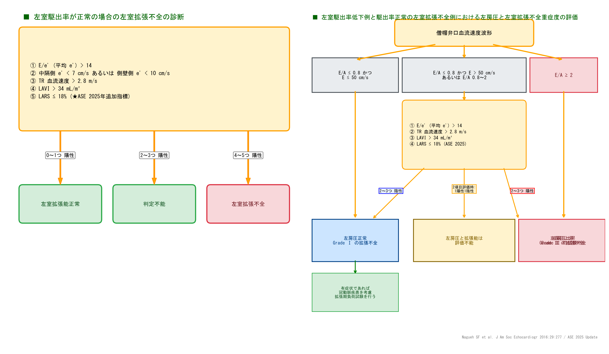

# 左室拡張能の評価アルゴリズム (ASE 2025 LARS対応)

本ページでは、臨床現場で迷わず数秒で判定できるよう、**ASE 2025年最新ガイドライン準拠のカスケード式フロー図** を掲載しています。

---

## ■ 左室拡張能評価 カスケードフロー図 (2パネル)

---

## 1. 判定に用いる5大指標とカットオフ値

| 指標 | カットオフ | 意味 |
| :--- | :--- | :--- |
| **中隔側 e'** | $< 7 \text{ cm/s}$ | 心筋弛緩障害 |
| **側壁側 e'** | $< 10 \text{ cm/s}$ | 心筋弛緩障害 |
| **平均 E/e' 比** | $> 14.0$ | 左房圧上昇 |
| **★ LARS** (ASE 2025新導入) | **$\le 18.0\%$** | 左房機能低下 |
| **LAVI** | $> 34 \text{ mL/m}^2$ | 慢性左房圧負荷 |
| **TR Vmax** | $> 2.8 \text{ m/s}$ | 肺動脈圧上昇 |

---

## 2. カスケード A：LVEF正常例 (≥ 50%) での拡張不全の診断

1. **判定指標**:
   - ① E/e'（平均e'）$> 14$
   - ② 中隔側 e' $< 7\text{cm/s}$ または 側壁側 e' $< 10\text{cm/s}$
   - ③ TR血流速度 $> 2.8\text{m/s}$
   - ④ LAVI $> 34\text{mL/m}^2$
   - ⑤ LARS $\le 18\%$ (★ASE 2025年追加)
2. **分岐**:
   - **0〜1つ 陽性** ➔ **左室拡張能 正常**
   - **2〜3つ 陽性** ➔ **判定不能**
   - **4〜5つ 陽性** ➔ **左室拡張不全**

---

## 3. カスケード B：LVEF低下例・拡張不全確定例の左房圧・重症度評価

1. **僧帽弁口血流速度波形 (E/A比)** を確認:
   - **$E/A \le 0.8$ かつ $E \le 50\text{cm/s}$** ➔ **左房圧正常 / Grade I の拡張不全**
   - **$E/A \ge 2.0$** ➔ **左房圧上昇 / Grade III の拡張不全**
   - **中間群 ($E/A \le 0.8$ かつ $E > 50\text{cm/s}$ または $E/A = 0.8 \sim 2$)** ➔ 複合指標で再評価

2. **複合指標による再評価**:
   - 2〜3つ 陰性 ➔ **左房圧正常 / Grade I の拡張不全**
   - 2項目のみ評価可能で1陽1陰 ➔ **左房圧と拡張能は評価不能**
   - 2〜3つ 陽性 ➔ **左房圧上昇 / Grade II の拡張不全**

> [!TIP]
> **★ ASE 2025年改訂のポイント**
> 従来4項目だった判定指標に **LARS ($\le 18\%$)** が追加されたことで、判定不能（グレーゾーン）に陥る症例が大幅に減少し、より確実な診断が可能となりました。
