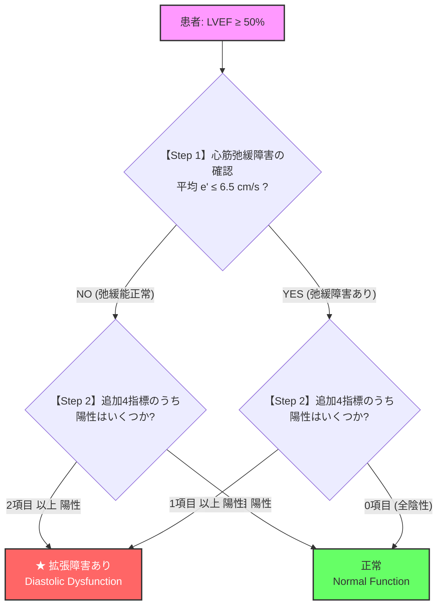
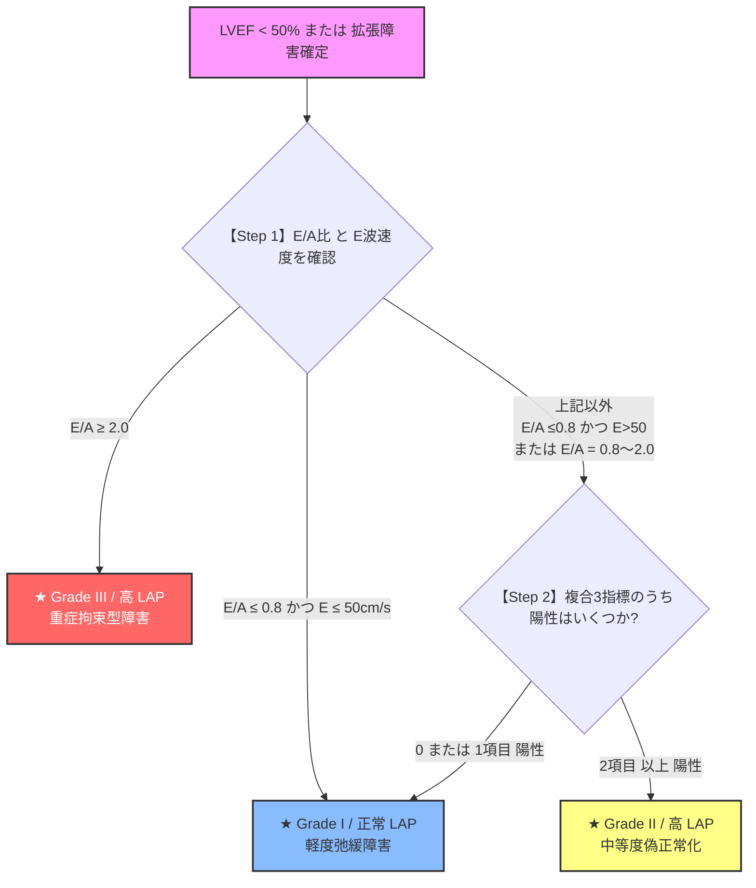

# 左室拡張能の評価アルゴリズム (ASE 2025 LARS対応)

本ページでは、臨床現場で迷わず数秒で左室拡張能障害（Diastolic Dysfunction）および左房圧（LAP）上昇を判定できるよう、**ASE 2025年最新ガイドラインに準拠した「カスケード式（段階的分岐）フロー」** で整理しています。

---

## 1. 判定に用いる5大指標とカットオフ値

まず以下の5つの計測項目を確認します。

```
1. 平均 e' 速度       ➔ ≤ 6.5 cm/s (中隔 <7 / 側壁 <10 cm/s) で弛緩障害
2. 平均 E/e' 比       ➔ > 14.0 で左房圧上昇
3. 左房ストレインLARS ➔ ≤ 18.0% で機能低下 (★ASE 2025新導入)
4. 左房容積係数 LAVI  ➔ > 34.0 mL/m² で左房拡大
5. E/A 比             ➔ ≤ 0.8 または ≥ 2.0 で異常
```

---

## 2. 【カスケード A】 LVEF 正常例 (≥ 50%) での「拡張能障害」判定ツリー

LVEFが保たれている症例（HFpEF疑い含む）において、拡張障害があるか否かを判定するカスケード分岐です。



### 追加の4指標（チェックリスト）
- [ ] ① **平均 E/e' 比 $> 14.0$**
- [ ] ② **左房リザーバーストレイン (LARS) $\le 18.0\%$**
- [ ] ③ **左房最大容積係数 (LAVI) $> 34.0 \text{ mL/m}^2$**
- [ ] ④ **E/A 比 $\le 0.8$ または $\ge 2.0$**

> [!TIP]
> **ASE 2025年改訂のポイント**
> LARS ($\le 18\%$) を評価に組み込んだことで、従来の「判定保留 (Indeterminate)」がなくなり、1つでも陽性があれば拡張障害とすっきり判定できるようになりました。

---

## 3. 【カスケード B】 LVEF 低下例 または 拡張障害確定例の「左房圧(LAP)・Grade」判定ツリー

LVEF $< 50\%$ の患者、または上記カスケードAで「拡張障害あり」と判定された患者の**左房圧 (LAP) が高いかどうか**、および **Grade (I〜III)** を決定するカスケード分岐です。



### Step 2 で確認する複合3指標
- [ ] ① **平均 E/e' 比 $> 14.0$**
- [ ] ② **左房リザーバーストレイン (LARS) $\le 18.0\%$**
- [ ] ③ **左房最大容積係数 (LAVI) $> 34.0 \text{ mL/m}^2$**

---

## 4. 臨床で3秒で判断する一発まとめ表

| 疾患・患者状態 | 最重要観察ステップ | 結論の出し方 |
| :--- | :--- | :--- |
| **LVEF正常で呼吸困難 (HFpEF疑い)** | カスケード A | **e' $\le 6.5$** があり、**E/e'>14 や LARS$\le 18\%$** が1つでもあれば **拡張障害あり** |
| **LVEF低下の心不全 (HFrEF)** | カスケード B | **$E/A \ge 2.0$** なら直ちに **Grade III (高LAP)**。中間なら **E/e'>14 や LARS$\le 18\%$ が2つ以上で Grade II (高LAP)** |

> [!WARNING]
> **特殊病態での注意点**
> - **心房細動 (Af)**: A波がないため $E/A$ 不可。$E/e' > 14$ や $LARS \le 18\%$、TR $V_{max} > 2.8\text{m/s}$ で高LAPを判定。
> - **僧帽弁疾患 (MR)**: E波が高くなるため、$E/e'$ より **LARS** を重視して評価する。
