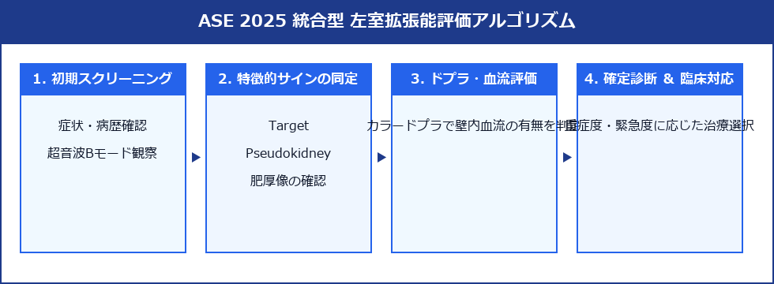
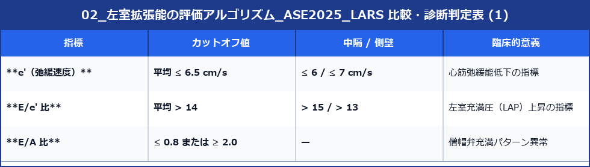
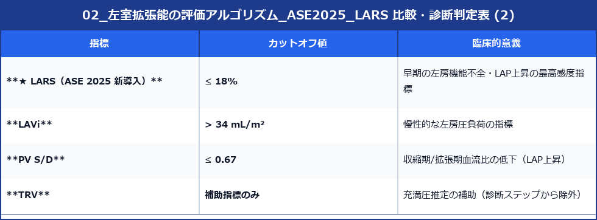
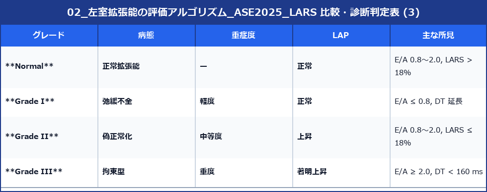

# 左室拡張能の評価アルゴリズム (ASE 2025 LARS対応 統合型)

2025年に発表された米国心エコー図学会（ASE）の新しい左室拡張能評価ガイドラインでは、従来の2016年版で課題であった**「判定不能（Indeterminate）」を大幅に減らすため、左房リザーバーストレイン（LARS：Left Atrial Reservoir Strain）を主軸とした2段階のステップアップ方式アルゴリズム**が導入されました。

さらに、従来のLVEF（左室駆出率）が正常か低下しているかによるアルゴリズムの分岐が廃止され、**すべての患者に適用できる統合型（ユニバーサル）アルゴリズム**へと進化しています。

---

## ■ ASE 2025 統合型フローチャート図 (2段階Step方式)

---

## 1. 主な指標と異常値のカットオフ

LARSの導入に加え、主要なカットオフ値がアップデートされています。

### Step 1 ── 基本指標

### Step 2 ── 詳細指標（セカンダリ）

---

## 2. ASE 2025 新評価アルゴリズム (2段階Step手法)

判定は以下の **【Step 1】** と **【Step 2】** を順に追う形で決定されます。

### 【Step 1】基本指標による初期評価
まず、基本的な組織ドプラおよびパルスドプラ指標（e'、E/e'、E/A比など）を用いて心筋弛緩能と充満圧の基本評価を行います。

1. **確定診断パターン**:
   - 心筋弛緩能の低下（e'低下）があり、かつ充満圧上昇の所見（E/e' $> 14$ など）が完全に一致（合致）する場合は、その時点で**拡張機能障害（Grade I〜III）が確定**します。
   - すべての指標が正常範囲で一致する場合は、**「正常 (Normal)」が確定**します。
2. **Step 2 へ移行するパターン**:
   - 各指標の結果が乖離している（例：e'は低下しているがE/e'は正常範囲など）、あるいは情報が不十分で初期評価だけでは確定できない場合は、**Step 2** へ進みます。

### 【Step 2】詳細指標 (LARS等) による決定
Step 1で判定がつかなかった症例に対して、以下の詳細（セカンダリ）指標を適用します。

- **LARS (左房リザーバーストレイン) $\le 18\%$**
- **PV S/D (肺静脈血流比) $\le 0.67$**
- **LAVi (左房容量係数) $> 34 \text{ mL/m}^2$**

> [!IMPORTANT]
> **【判定ルール】**
> - Step 2の指標において**いずれか1つでも異常（LARS $\le 18\%$ など）が認められた場合、左室充満圧 (LAP) の上昇があるとみなされ、確定的な拡張機能障害グレードが割り当てられます**。
> - これらすべてが正常であれば、LAPは正常と判断されます。
> - これにより、2016年版で頻発していた「判定不能」が実質的に0（ゼロ）へと解消され、決定論的（deterministic）な診断経路が確立されました。

---

## 3. 拡張機能障害の最終グレード分類

確定した病態は、左室充満圧 (LAP) の状態に応じて以下のように分類されます。

---

## 4. 臨床応用における注意点 (Specific Populations)

2025年版では、一般的なアルゴリズムをそのまま適用できない特殊病態（Specific Populations）が明記されており、個別の評価アプローチが推奨されています。

- **心房細動 (AF)**:
  - A波が消失するため E/A比 は使えません。LARSや肺静脈血流、E/e'の変化、および一回拍出量の変動などを総合して評価します。
- **高度な僧帽弁輪石灰化 (MAC) / 僧帽弁疾患**:
  - 弁自体の硬化により、組織ドプラ（e'）や E/e' の信頼性が著しく低下します。等容拡張時間（IVRT）や **LARS** が代替指標として重視されます。詳細な病態・心臓石灰化無定形腫瘍（CAT）や脳梗塞リスク・手術適応については [[04_僧帽弁輪石灰化_MAC_と心臓石灰化無定形腫瘍_CAT]] を参照。
- **その他 (人工弁・移植・LVAD)**:
  - 人工弁置換術後、心臓移植後、左室補助人工心臓（LVAD）装着患者なども、個別の専用評価ルートが用意されています。
