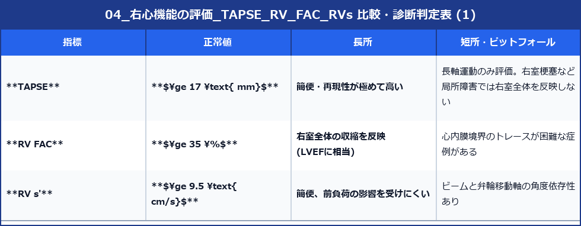

# 右心機能の評価 (TAPSE, RV FAC, RV s')

右室は三日月型かつ複雑な立体構造を持つため、左室のように単一の断面からLVEF（容積法）を求めることが困難です。そのため、長軸運動・全体の面積変化・組織移動速度を多角的に計測して右室収縮機能を評価します。

---

## 1. TAPSE (Tricuspid Annular Plane Systolic Excursion)

三尖弁輪（外側壁）が収縮期に心尖部方向へどれだけ移動したか（移動距離: mm）を計測する、最も簡便で再確認性の高い指標です。

### 1) 計測手順
- **断面**: 心尖部4腔断面 (AP4)
- **方法**: Mモードのカーソルを三尖弁輪の外側壁（側壁ヒンジ部）に合わせます。
- **カーソル角度**: Mモードビームが弁輪の心尖部方向への移動軸と**平行**になるよう角度を調整します。
- **計測**: 拡張末期の最下点から、収縮期の最高点までの垂直移動距離 (mm) を計測します。

### 2) 正常基準値
- **正常値**: **$\ge 17.0 \text{ mm}$**
- **低下 (機能障害)**: **$< 17.0 \text{ mm}$**

---

## 2. 右室面積変化率 (RV FAC: Fractional Area Change)

右室全体の収縮能（長軸＋短軸収縮）を反映する、左室のLVEFに相当する強力な指標です。

### 1) 計測手順
- **断面**: 右室強調心尖部4腔断面 (RV-focused AP4)
- **方法**:
  1. 拡張末期 (ED) の右室心内膜面をトレースし、面積 ($RV\text{EDArea}$) を算出。
  2. 収縮末期 (ES) の右室心内膜面をトレースし、面積 ($RV\text{ESArea}$) を算出。
  3. 肉柱 (Trabeculations) は内腔に含めるように心筋壁面に沿って滑らかにトレースします。

$$\text{RV FAC (\%)} = \frac{RV\text{EDArea} - RV\text{ESArea}}{RV\text{EDArea}} \times 100$$

### 2) 正常基準値
- **正常値**: **$\ge 35.0\%$**
- **低下 (機能障害)**: **$< 35.0\%$**

---

## 3. 右室組織ドプラ収縮波速度 (RV s')

組織ドプラ法 (TDI) を用いて、三尖弁輪側壁部の収縮期最高移動速度 (cm/s) を計測します。

- **断面**: 心尖部4腔断面 (AP4)
- **方法**: 三尖弁輪側壁部にTDIのサンプルボリューム（3〜5mm）を置き、収縮期に心尖部へ向かう正の波形 (s' 波) のピーク速度を計測します。
- **正常基準値**: **$\ge 9.5 \text{ cm/s}$** （$<9.5\text{cm/s}$ で右室機能低下）

---

## 4. 右心機能評価指標の比較まとめ

> [!WARNING]
> 心臓手術（心臓開胸手術）後の患者では、心膜切開の影響により TAPSE や RV s' が生理的に著明低下（例: TAPSE 10mmなど）しますが、RV FAC は保たれていることがあります。**術後の右心機能評価には TAPSE ではなく RV FAC を用いるのが鉄則**です。
