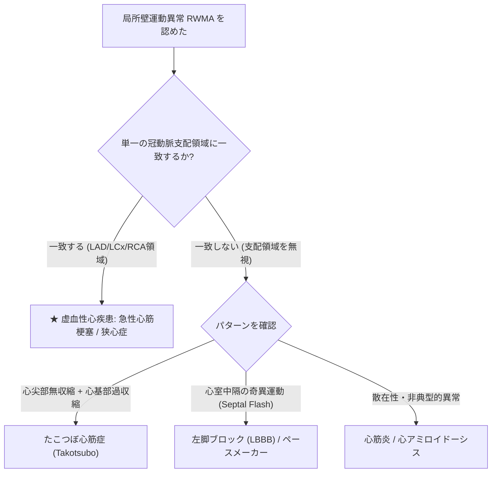

# 局所壁運動異常 (RWMA) と WMSI の評価

虚血性心疾患（狭心症・心筋梗塞）の超音波診断において、心筋の局所的な動態と収縮期壁厚増加率を判定する **局所壁運動異常 (Regional Wall Motion Abnormality: RWMA)** の評価は最重要項目です。

---

## 1. 壁運動スコア (Wall Motion Score: WMS) の判定基準

評価は「心筋の内側への移動 (Inward displacement)」だけでなく、**「収縮期の心筋壁厚の増加 (Systolic Wall Thickening)」** を総合して判定します。

| スコア | 壁運動分類 | 収縮期の動態特徴 | 収縮期壁厚増加率 ($\Delta T$) | 臨床的意義 |
| :---: | :--- | :--- | :---: | :--- |
| **1** | **正常 (Normokinesis)** | 心筋が良好に内側へ移動し、壁が分厚くなる | **$> 30\%$** | 正常心筋 |
| **2** | **運動低下 (Hypokinesis)** | 心筋の内側移動が乏しく、壁の肥厚が乏しい | **$< 30\%$** | 虚血、冬眠心筋、軽度梗塞 |
| **3** | **無運動 (Akinesis)** | 心筋の内側移動がなく、壁の肥厚が全くない | **$0\%$ (変化なし)** | 透壁性心筋梗塞 (壊死・線維化) |
| **4** | **奇異性運動 (Dyskinesis)** | 収縮期に内側ではなく**外側へ膨隆・突出す** | **マイナス (菲薄化)** | 梗塞巣の急性〜慢性拡張・心室瘤 |
| **5** | **心室瘤 (Aneurysm)** | 収縮期・拡張期を通じて常に外側に瘤状突出 | **$0\%$ (変形固定)** | 慢性期確立型左室瘤 |

---

## 2. 壁運動スコア指標 (WMSI: Wall Motion Score Index) の算出

左室全体の壁運動異常の広がり（虚血・梗塞範囲）を定量化する指標です。

$$\text{WMSI} = \frac{\sum (\text{評価できた全セグメントの WMS スコア})}{\text{評価セグメント数 (16 または 17)}}$$

- **正常値**: **$\text{WMSI} = 1.0$** （全セグメントがスコア1）
- **軽度〜中等度異常**: $\text{WMSI} = 1.1 \sim 1.6$
- **高度広範障害**: **$\text{WMSI} > 1.7 \sim 2.0$** （予後不良、ポンプ不全・心不全リスク極大）

---

## 3. 虚血性心疾患と非虚血性疾患の鑑別ポイント

> [!IMPORTANT]
> **「冠動脈支配領域に一致しているか」が最大の鑑別点**です。

### 1) たこつぼ心筋症 (Takotsubo Cardiomyopathy)
- **特徴**: ストレス等を契機に発症。単一冠動脈領域を超えて**心尖部〜中間部が広範に無運動 (Akinesis)** となり、**心基部のみが過収縮 (Hyperkinesis)** して「たこつぼ」状の形態を呈します。冠動脈造影で有意狭窄を認めないのが特徴。

### 2) 左脚ブロック (LBBB) および 右室ペースメーカー刺激
- **特徴**: 電気伝導の遅延により、心室中隔が収縮早期に右室側へペコッと落ち込む動作（**Septal Flash / 奇異性中隔運動**）を示します。これは虚血（RWMA）ではなく**非同期的収縮 (Dyssynchrony)** によるものです。

### 3) 急性心筋梗塞 (AMI) における壁運動の変化
- 虚血発症後**数秒**で Hypokinesis ➔ Akinesis へ移行します。
- 慢性期に壁厚が薄く輝度が高くなっている (Thinning & Bright) 場合は、透壁性の古い梗塞巣（瘢痕化）を意味します。
