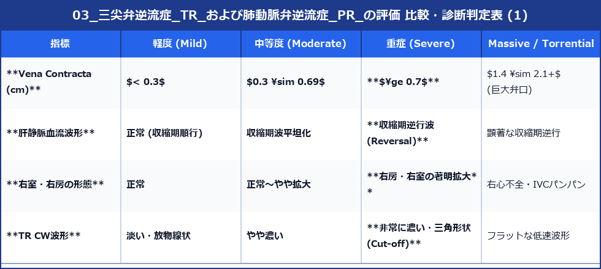
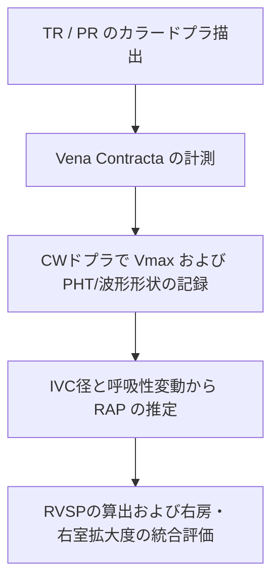

# 三尖弁逆流症 (TR) および 肺動脈弁逆流症 (PR) の評価

右心系弁膜症である三尖弁逆流症 (TR) と 肺動脈弁逆流症 (PR) は、右室・右房への負荷評価および肺動脈圧（右心圧）の非侵襲的推定において重要です。

---

## 1. 三尖弁逆流症 (TR) の評価

### 1) TR のメカニズム分類
- **一次性 (器質性) TR**: 感染性心内膜炎 (IE)、外傷、ペースメーカーリードによる損傷、カルチノイドなど。
- **二次性 (機能性) TR (最多)**: 肺高血圧症、左心疾患（MRやAF）、右室・右房拡大に伴う三尖弁輪の拡大および弁テザリングによる接合障害。

### 2) TR Vmax による右室収縮期圧 (RVSP) 推定
簡易ベルヌーイの定理 $P = 4 \times v^2$ を用いて推定します。

$$\text{RVSP (mmHg)} = 4 \times (\text{TR } V_{max})^2 + \text{推定右房圧 (RAP)}$$

- ※肺動脈弁狭窄 (PS) がない場合、**$\text{RVSP} \approx \text{肺動脈収縮期圧 (SPAP)}$** とみなします。
- **RAP 推定**: 下大静脈径 (IVC径 $\le 21\text{mm}$) と Sniffテストの呼吸虚脱率 ($>50\%$) で **3, 8, 15 mmHg** を加算します。

### 3) TR 重症度分類 (ASE 2017)





> [!IMPORTANT]
> **Torrential / Massive TR のCW波形注意点**
> 弁口が崩壊した極めて重度のTR (Massive/Torrential) では、右室と右房の圧が均等化（等圧化）するため、逆に **TR Vmax が $2.0 \text{ m/s}$ 以下に低下し、波形が早期に減衰する三角形**になります。Vmaxが低いからといって「軽症」と誤認しないよう注意します。

---

## 2. 肺動脈弁逆流症 (PR) の評価

PRは生理的にも少量認められますが、**ファロー四徴症 (TOF) 根治術後（成人期ACHD）** や肺高血圧症に伴う重症PRが臨床上重要です。

### 1) 評価断面
- 傍胸骨大動脈弁短軸断面 (PSAX-AV) または 肺動脈分岐部断面。

### 2) 重症PRのCWドプラ所見と PHT
- **CW波形の輝度**: 順行性血流と同じくらい濃いシグナル。
- **圧半減時間 (PHT)**:
  - 拡張期に肺動脈と右室の圧が急速に均等化するため、波形の傾きが急峻になります。
  - **重症 PR 判定基準**: **$\text{PHT} < 100 \text{ ms}$**

```
【重症 PR の CW ドプラ波形】
      0 ─────────────────────────────
        │  │＼  (PHT < 100ms: 急急峻)
        │  │  ＼  拡張期逆流波 (右室へ向かう)
```

---

## 3. 右心系逆流症の観察手順まとめ


