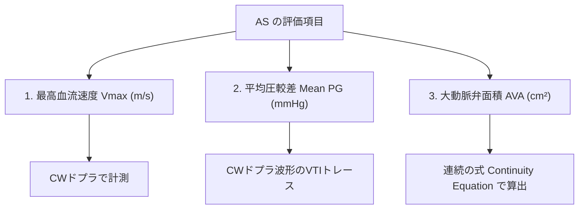

# 大動脈弁狭窄症 (AS) の評価 (Vmax, Mean PG, AVA, LF-LG AS)

大動脈弁狭窄症 (Aortic Stenosis: AS) は、高齢化に伴い最も頻度の高い弁膜症です。介入（AVRまたはTAVI）の適応判断において、エコーによる血流体力学パラメーターの正確な評価が不可欠です。

---

## 1. 3大基本評価指標



### 1) 大動脈弁最高血流速度 ($V_{max}$)
- **方法**: 連続波ドプラ (CW) を使用。**心尖部5腔/3腔アプローチ、右第2肋間アプローチ（Pedoffプローブ）、胸骨上窩アプローチ**の複数ウィンドウからビームを当て、**最も高い速度値**を採用します。
- **重症基準**: **$V_{max} \ge 4.0 \text{ m/s}$**

### 2) 平均圧較差 (Mean PG)
- **方法**: CWドプラ波形の収縮期エッジをなぞり（VTIトレース）、ベルヌーイの定理 $P = 4v^2$ の平均値を自動計算させます。
- **重症基準**: **$\text{Mean PG} \ge 40 \text{ mmHg}$**

---

## 2. 連続の式による大動脈弁面積 (AVA) の算出

流量保存の法則（LVOTを一拍で通る血液量 ＝ 大動脈弁口を通る血液量）に基づきます。

$$\text{AVA (cm}^2) = \frac{LVOT\text{ Area} \times LVOT\text{-VTI}}{AV\text{-VTI}} = \frac{\pi \times \left( \frac{LVOT\text{径}}{2} \right)^2 \times LVOT\text{-VTI}}{AV\text{-VTI}}$$

```
【連続の式の概念図】
   左室流出路 (LVOT)           大動脈弁 (AV)
  ┌────────────────┐           ┌──┐
  │ Area_LVOT      │ ──流出──> │  │ Area_AV (AVA)
  └────────────────┘           └──┘
   (内径から断面積算出)          (求めたかった弁面積)
```

- **計測のコツ**: 
  - $LVOT\text{径}$: PLAX収縮中期に弁輪直下 $0.5 \sim 1.0\text{ cm}$ で正確に計測。
  - $LVOT\text{-VTI}$: AP5/AP3のPWドプラで計測。
  - $AV\text{-VTI}$: AP5/AP3等のCWドプラで計測。
- **重症基準**: **$\text{AVA} < 1.0 \text{ cm}^2$** （インデックス: $\text{AVAI} < 0.6 \text{ cm}^2/\text{m}^2$）

---

## 3. AS 重症度分類一覧 (ASE/EACVI / JCS 2020)


---

## 4. 特殊病態：Low-Flow Low-Gradient AS (LF-LG AS)

「弁面積は $\text{AVA} < 1.0\text{cm}^2$（重症パターン）なのに、圧較差が $\text{Mean PG} < 40\text{mmHg}$（中等度パターン）」となる解離性の病態です。

### 1) Classical Low-Flow Low-Gradient AS (LVEF低下型)
- **病態**: LVEFが低下（$< 50\%$）しているため、左室が血液を押し出す力（一回拍出量 SV）が弱く、狭窄が重症であっても圧較差が上がらない。
- **鑑別手段**: **低用量ドブタミン負荷心エコー (DSE)** を実施します。
  - **真の重症 AS**: ドブタミン注入でSVが増加しても AVA は $<1.0\text{cm}^2$ のまま、$\text{Mean PG} \ge 40\text{mmHg}$ に跳ね上がる ➔ 手術/TAVI適応。
  - **偽の重症 AS (Pseudo-severe AS)**: 心筋収縮力が戻ると弁が押し開かれて $\text{AVA} > 1.0\text{cm}^2$ へ拡大する。

### 2) Paradoxical Low-Flow Low-Gradient AS (LVEF保持型)
- **病態**: LVEFは保持（$\ge 50\%$）されているが、小左室・高度な求心性肥大（高血圧等）により左室拡張末期容積が小さすぎ、一回拍出量係数 ($SVI < 35 \text{ mL/m}^2$) が低下している病態。高血圧のコントロール後に再評価します。

---

## 5. ピットフォールと注意点

> [!WARNING]
> **マルチアプローチを怠った速度過小評価**
> 心尖部アプローチ（AP5/AP3）のみでCWドプラを当てると、ASジェットが斜めに逃げている場合、Vmaxを $3.5\text{m/s}$（中等度）と過小評価して重症ASを見落とします。**右第2肋間（Pedoffプローブ）からの計測が真の最高速度をとることが非常に多い**です。
