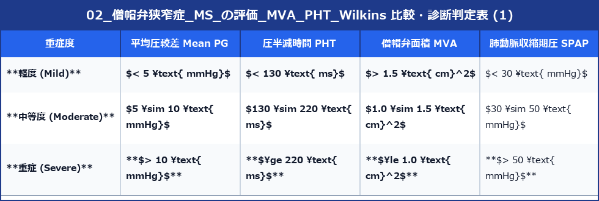
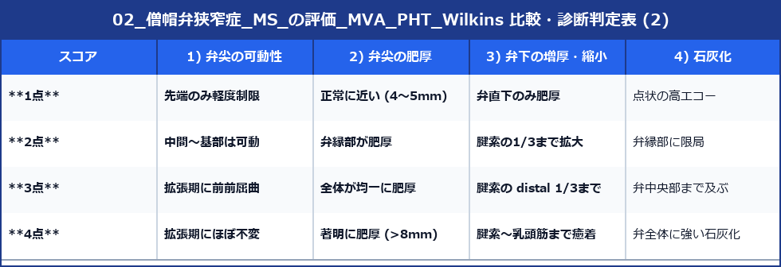

# 僧帽弁狭窄症 (MS) の評価 (MVA, PHT, Wilkinsスコア)

僧帽弁狭窄症 (Mitral Stenosis: MS) は、主にリウマチ熱の既往や加齢性弁輪石灰化 (MAC) によって発生し、左心房圧上昇、左房拡大、心房細動 (Af)、血栓形成および肺高血圧症を惹起します。

---

## 1. 僧帽弁面積 (MVA: Mitral Valve Area) の計測

### 1) 直接面積計測法 (Planimetry 法) ★黄金標準
- **断面**: 傍胸骨左室短軸断面 (PSAX)
- **方法**: 拡張早期の僧帽弁先端部が最も大きく開口する時相において、前尖・後尖の交連部を含めた最小弁口の内輪郭を2D像でトレースします。
- **注意**: 弁口先端より心筋寄り（基部側）を切ると弁面積を過大評価するため、ズーミングして最も狭い箇所でトレースします。

### 2) 圧半減時間法 (PHT 法: Pressure Half-Time)
拡張初期の最高拡張圧較差が**半分 (1/2)** に減衰するまでの時間 $PHT \text{ (ms)}$ をCWドプラから計測します。

$$\text{MVA (cm}^2) = \frac{220}{PHT \text{ (ms)}}$$

- **断面**: AP4から僧帽弁流入血流にCWドプラを当て、E波の減衰傾斜 (Deceleration slope) をトレースします。
- **注意点**: 著しい左室コンプライアンス低下やAR併発時にはPHT誤差が生じます。

---

## 2. MS 重症度判定基準一覧

---

## 3. Wilkins (ウィルキンス) スコア (PTMC 適応判定)

カテーテル治療（経皮的僧帽弁交連切開術: PTMC）の適応を評価するため、僧帽弁の形態を4項目（各1〜4点、計16点満点）でスコア化します。

- **判定**: **合計 $\le 8$ 点** の場合、弁の形態が柔らかく良好なため **PTMC (カテーテル治療) の最良適応** となります（$\ge 11$ 点では弁置換術を検討）。
