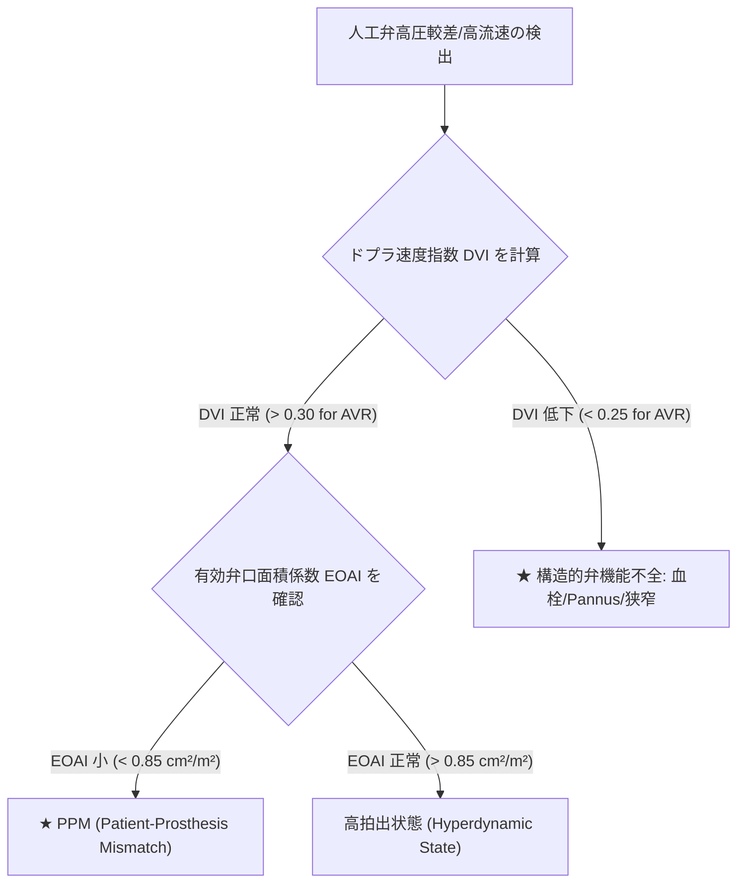
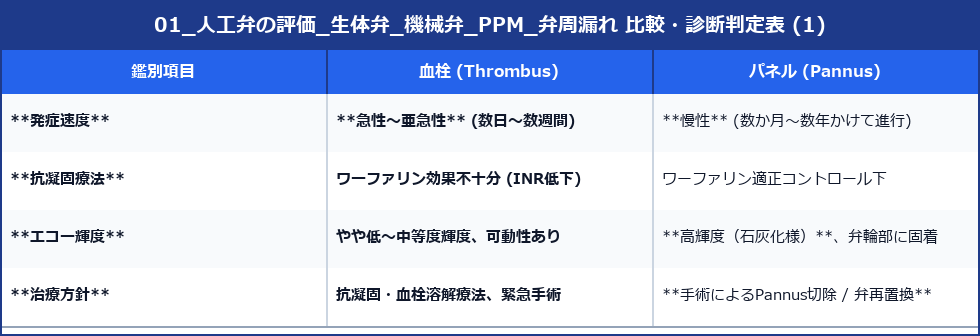

# 人工弁の評価 (生体弁・機械弁・PPM・弁周漏れ)

人工弁置換術後（またはカテーテル大動脈弁留置術: TAVR/TAVI後）の患者において、人工弁の正常機能確認および機能不全（血栓・パネル・弁周漏れ・PPM）の早期発見を行うための評価指針です。

---

## 1. 人工弁の分類とエコー上の構造特徴

### 1) 機械弁 (Mechanical Valve)
- **種類**: 二葉弁 (Bileaflet: SJS, St. Judeなど)、傾斜単葉弁 (Tilting-disc: Bjork-Shiley)、ボール弁 (Starr-Edwards)。
- **エコー特徴**: 強い金属反射（高輝度エコー）と、弁の後方に広がる強い**音響陰影 (Acoustic Shadowing)**。
- **正常洗浄流 (Washing Jets)**: 構造上、微量の逆流（正常洗浄ジェット）が認められます（異常な弁周漏れとの鑑別が必要）。

### 2) 生体弁 (Bioprosthetic Valve)
- **種類**: 豚大動脈弁、牛心膜弁、TAVI弁 (SAPIEN, Evolutなど)。
- **エコー特徴**: 機械弁に比べて音響陰影が少なく、自己弁に近い構造観察が可能。ただし**経年劣化（石灰化・引きつれ・断裂）** が起こります。

---

## 2. 人工弁評価の基本パラメータ

人工弁は構造上、自己弁よりも有効弁口面積が狭く、**正常であっても一定の通過流速・圧較差（高流速パターン）** を呈します。

### 1) ドプラ速度指数 (DVI: Doppler Velocity Index)
大動脈弁位人工弁 (AVR) において、前負荷に依存せずに弁狭窄を判定する指標です。

$$\text{DVI} = \frac{VTI_{LVOT}}{VTI_{AVR}}$$

- **正常**: **$\text{DVI} > 0.30$** （通常 $0.35 \sim 0.45$）
- **異常狭窄疑い**: **$\text{DVI} < 0.25$** （弁開放制限、血栓、Pannusを疑う）

---

## 3. 人工弁不全の主要原因と鑑別法

### 1) Patient-Prosthesis Mismatch (PPM)
- **病態**: 人工弁自体には器質的障害がないが、**患者の体格（BSA）に対して植え込まれた人工弁のサイズ（弁口面積）が相対的に小さすぎる**状態。
- **判定**: 有効弁口面積係数 ($\text{EOAI} = \text{EOA} / \text{BSA}$)
  - **PPM なし**: $\text{EOAI} > 0.85 \text{ cm}^2/\text{m}^2$
  - 軽度〜中等度 PPM: $\text{EOAI} = 0.65 \sim 0.85 \text{ cm}^2/\text{m}^2$
  - **重症 (Severe) PPM**: **$\text{EOAI} < 0.65 \text{ cm}^2/\text{m}^2$**

### 2) 血栓 (Thrombus) vs パネル (Pannus)
人工弁の開放制限（高圧較差・DVI低下）を来す2大原因の鑑別です。

### 3) 弁周漏れ (PVL: Paravalvular Leak)
- **病態**: 人工弁のカフ（縫合輪）と自己弁輪組織との隙間から発生する逆流。縫合不全や縫合部の石灰化壊死（感染性心内膜炎）が原因。
- **観察**: 機械弁の強い音響陰影の陰に隠れやすいため、**経食道心エコー (TEE) による3Dカラー観察が確定診断のゴールドスタンダード**となります。
- **周径比 (%)**: 人工弁の全周360度に対して、弁周漏れのカラー面積が何%を占めるか（$> 10\%$ で重症PVL）。
