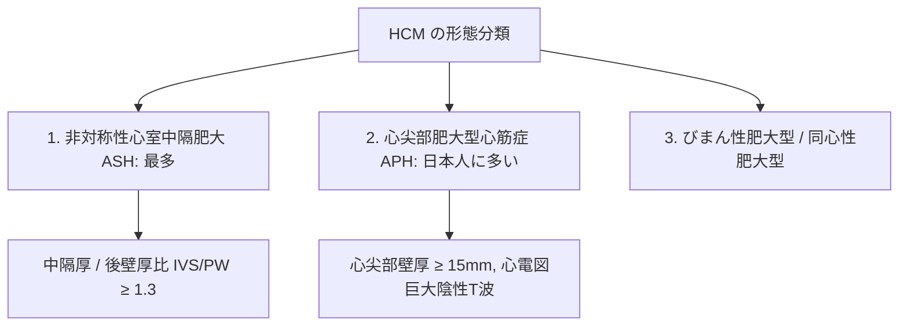
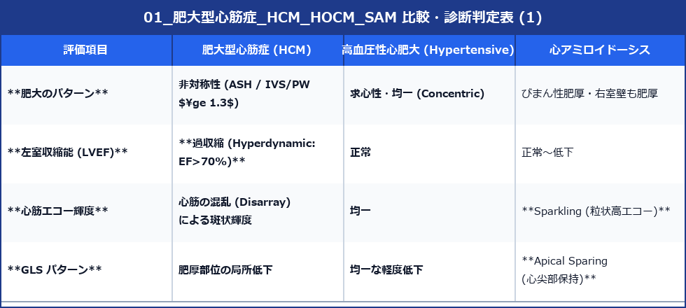

# 肥大型心筋症 (HCM, HOCM, SAM)

肥大型心筋症 (Hypertrophic Cardiomyopathy: HCM) は、高血圧などの明確な負荷因子がないにもかかわらず、心筋の非対称性肥大を呈する遺伝性心筋疾患です。

---

## 1. HCM の形態分類と診断基準

### 1) 基本診断基準
- **心筋肥厚**: 拡張末期において **心筋壁厚 $\ge 15 \text{ mm}$** （または第一度近親者にHCM患者がいる場合は $\ge 13 \text{ mm}$）。

### 2) 形態的分類



---

## 2. 閉塞性肥大型心筋症 (HOCM) と SAM 現象

肥大型心筋症の約1/3において、左室流出路 (LVOT) に収縮期圧較差（狭窄）が生じる **HOCM (Hypertrophic Obstructive CM)** が観察されます。

```
【HOCM と SAM（僧帽弁前尖前進運動）のメカニズム】
      中隔肥厚 (IVS) ➔ 流出路が狭小化
         ↓
      収縮期高速血流 ➔ ベンチュリ効果 (Venturi effect) で前尖が引っ張られる
         ↓
      SAM 現象 ➔ 僧帽弁前尖が中隔に衝突 ➔ 流出路閉塞 + 二次性MR発生
```

### 1) SAM 現象 (Systolic Anterior Motion of the Mitral Valve)
- **B/Mモード所見**: 収縮期に僧帽弁前尖（または後尖）が**心室中隔に向かって前進（上方移動）し、中隔に接触**します。
- **影響**: LVOTを狭窄させると同時に、僧帽弁尖の接合が外れて**収縮中期〜後期の二次性MR**を惹起します。

### 2) LVOT 圧較差と CW ドプラ波形
- **CW波形**: 収縮早期は血流がゆっくり出始めるが、収縮中期にSAMにより急激に狭窄するため、ピークが後半に遅れる **Dagger-shape (短剣状・凹型) の高速波形** を呈します。
- **閉塞の判定基準**:
  - **非閉塞性 (Non-obstructive)**: 安静時・負荷時ともに Peak PG $< 30 \text{ mmHg}$
  - **潜在性閉塞 (Labilly Obstructive)**: 安静時 Peak PG $< 30 \text{ mmHg}$ だが、**負荷時 Peak PG $\ge 30 \text{ mmHg}$**
  - **閉塞性 (Obstructive/HOCM)**: **安静時 Peak PG $\ge 30 \text{ mmHg}$** （$\ge 50\text{mmHg}$ で高度・治療介入適応）

---

## 3. 潜在性閉塞を検出する「バルサルバ負荷心エコー」

安静時にLVOT圧較差が小さくても、息こらえ（Valsalva手技）を行わせることで前負荷を減少させ、LVOT閉塞を誘発します（JASE『バルサルバ負荷心エコー図検査の手引き』2026年3月準拠）。

1. **手順**: 安静時描出後、患者に「息を吸って、みぞおちに力を入れて10秒間強く力んでください」と指示。
2. **観察**: 力み中にLVOTにCWドプラを当て、波形が Dagger-shape に変化し流速が跳ね上がるか確認（Peak PG $\ge 30\text{mmHg}$ 昇圧で陽性）。

---

## 4. 鑑別診断：二次性心肥大との対比




