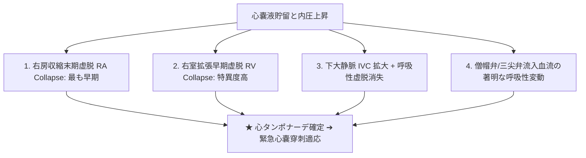
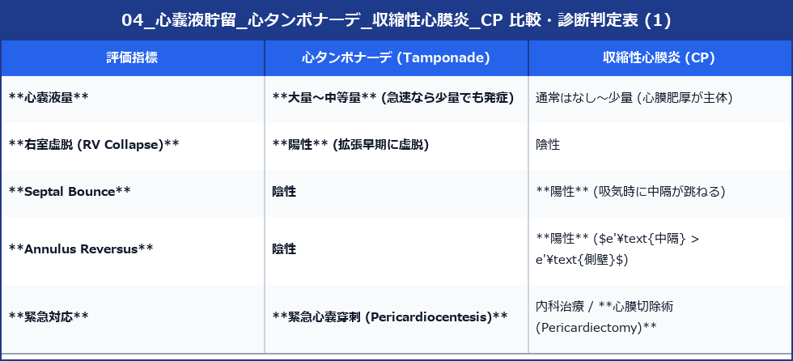

# 心嚢液貯留・心タンポナーデ・収縮性心膜炎 (CP)

心膜疾患は、急性の血流不全（心タンポナーデ）から慢性充満障害（収縮性心膜炎）まで、迅速な診断と生命救急対応が求められる領域です。

---

## 1. 心嚢液貯留 (Pericardial Effusion) の定量

壁側心膜と臓側心膜の間に貯留した Echo-free space (無エコー領域) の幅で定量します。

```
【心嚢液の貯留幅による分類】
- 少量 (Small):  収縮期〜拡張期を通じて < 10 mm (心室後壁側に限局)
- 中等量 (Moderate): 10 〜 20 mm (心臓周囲全体に存在)
- 大量 (Large):  > 20 mm (心臓が液中でプカプカ揺れる Swing heart)
```

- **胸水との鑑別**: PLAX断面において、貯留液が**降下大動脈 (Descending Aorta) の「前側（腹側）」にある場合は心嚢液**、「後ろ側（背側）」にある場合は胸水と判定します。

---

## 2. 心タンポナーデ (Cardiac Tamponade) のエコー診断

心嚢圧が上昇し、心室・心房の拡張期拡張が障害されて閉塞性ショック（血圧低下・奇脈）を来す救急病態です。



### 1) 主要な血流・構造サイン
1. **右房収縮末期虚脱 (RA Collapse)**: 収縮末期（右房が最も膨らむべき時相）に、右房壁が内側に凹む（1/3以上の心周期で虚脱）。最も感度が高いサイン。
2. **右室拡張早期虚脱 (RV Collapse)**: 拡張早期（右室が膨らみ始める時相）に、右室自由壁が内側に窪む。**タンポナーデに対する特異度が極めて高いサイン**。
3. **IVCの拡大と虚脱消失**: IVC径 $> 21 \text{ mm}$ かつ 吸気時虚脱率 $< 50\%$ （右房圧 $>15\text{mmHg}$ への上昇を反映）。
4. **房室弁血流の呼吸性変動**: 吸気時に僧帽弁E波速度が **$> 25\%$ 低下** し、三尖弁E波速度が **$> 40\%$ 上昇** する（心室相互依存性の増強）。

---

## 3. 収縮性心膜炎 (Constrictive Pericarditis: CP)

炎症等により心膜が肥厚・石灰化して硬くなり、心室の拡張期充満が障害される病態です。

### 1) 特徴的エコー所見
- **心膜の肥厚・石灰化**: 房室溝や右室前壁周囲の心膜が高輝度に肥厚。
- **Septal Bounce (心室中隔の跳ね返り運動)**: 吸気早期に、右室へ流入した血液が中隔を左室側へ急激に押し込む動き（心室相互依存性）。
- **Annulus Reversus (弁輪逆転現象)**: 組織ドプラにおいて、外側の側壁心膜が癒着して運動制限されるため、**中隔 e' 速度が 側壁 e' 速度よりも高値 ($e'\text{中隔} > e'\text{側壁}$)** に逆転します。

---

## 4. タンポナーデと収縮性心膜炎の緊急チェックリスト




