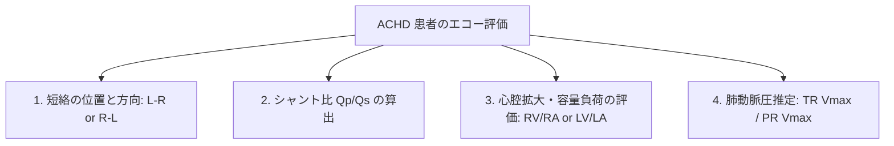

# 成人期先天性心疾患 (ACHD) と Qp/Qs シャント比計算

近年、小児期の手術成績向上に伴い、成人期に達した先天性心疾患患者 (Adult Congenital Heart Disease: ACHD) が急増しています。短絡（シャント）病変の定量的評価として **Qp/Qs (肺血流量 / 体血流量 比)** の算出が必須です。

---

## 1. Qp/Qs (肺血流量 / 体血流量 比) の算出原理

左から右への短絡（L-Rシャント: ASD, VSD, PDAなど）が存在する場合、肺血流量 ($Q_p$) が体血流量 ($Q_s$) よりも増加します。

$$\text{Qp/Qs Ratio} = \frac{\text{肺血流量 } Q_p}{\text{体血流量 } Q_s} = \frac{RVOT\text{ Stroke Volume}}{LVOT\text{ Stroke Volume}}$$

```
【Qp/Qs 計算の基本公式】
  Qp (肺血流量) = RVOT断面積 × RVOT-VTI
  Qs (体血流量) = LVOT断面積 × LVOT-VTI
```

### 1) Qs (体血流量一回拍出量) の計測
- **LVOT径**: PLAXの収縮中期に大動脈弁輪直下で計測。
- **LVOT-VTI**: AP5/AP3のPWドプラで左室流出路血流をトレース。

### 2) Qp (肺血流量一回拍出量) の計測
- **RVOT径**: PSAXの大動脈弁レベルで、肺動脈弁直下の右室流出路径を計測。
- **RVOT-VTI**: PSAXで肺動脈弁直下にPWドプラを置き、流出波形をトレース。

### 3) 臨床的判定基準と閉鎖適応 (ASD/VSD/PDA)
- **$\text{Qp/Qs} < 1.5$**: 軽度短絡（経過観察可能）。
- **$\text{Qp/Qs} \ge 1.5$**: **有意な短絡あり** ➔ **右心系・左心系の容量負荷を来すため、カテーテル遮断術または手術閉鎖の適応**となります。
- **$\text{Qp/Qs} < 1.0$ (逆シャント)**: アイゼンメンジャー症候群（右➔左シャント化）を示し、閉鎖手術は絶対禁忌となります。

---

## 2. ACHD エコー評価の基本チェックリスト


