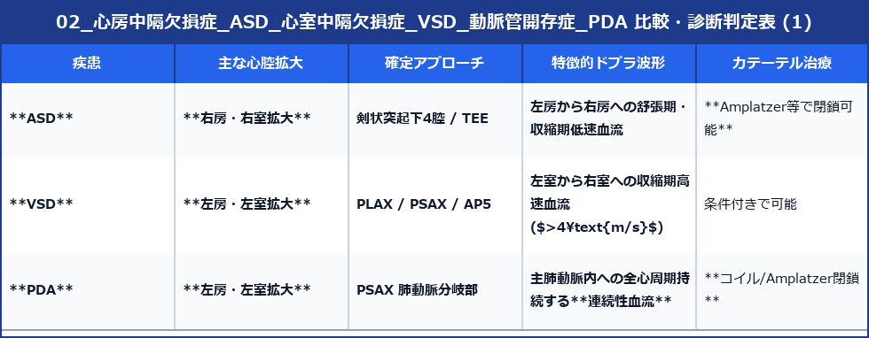

# 心房中隔欠損症 (ASD)・心室中隔欠損症 (VSD)・動脈管開存症 (PDA)

成人期に発見される代表的な非チアノーゼ性左右短絡（L-Rシャント）先天性心疾患の超音波診断です。

---

## 1. 心房中隔欠損症 (ASD: Atrial Septal Defect)

成人ACHDで最も頻度の高い疾患です。

### 1) 分類と解剖位置
- **二次孔欠損型 (Secundum: 70〜80%)**: 卵円窩付近の欠損（カテーテル閉鎖術 Closure の適応）。
- 一次孔欠損型 (Primum): 房室弁側（房室弁接合部異常を合併）。
- 静脈洞型 (Sinus venosus): 上大静脈・下大静脈開口部付近（部分肺静脈還流異常 PAPVR を合併）。

### 2) エコー所見
- **剣状突起下4腔断面 (Subcostal 4C)**: ビームが中隔に垂直に当たるため、AP4で生じる偽性の欠損像 (Echo drop-out) を排除して欠損孔を確定観察します。欠損端に **T-artifact (増強エコー)** が認められます。
- **右心容量負荷**: **右室・右房の顕著な拡大**、および拡張期の心室中隔平坦化 (**D-shape**)。

---

## 2. 心室中隔欠損症 (VSD: Ventricular Septal Defect)

### 1) 分類
- **膜性部欠損型 (Perimembranous: II型 - 最多)**: 傍胸骨長軸で大動脈弁直下に欠損孔を描出。
- 漏斗部欠損型 (Subarterial: I型): 大動脈弁と肺動脈弁の直下（大動脈弁脱垂とAR合併に注意）。
- 筋性部欠損型 (Muscular: III型)。

### 2) VSD 短絡血流速度による右室圧推定
CWドプラでVSDジェットの最高速度 ($V_{VSD}$) を計測します。

$$\text{右室収縮期圧 (RVSP)} = \text{最高血圧 (SBP)} - 4 \times (V_{VSD})^2$$

- 高速ジェット ($V_{VSD} > 4.5 \text{ m/s}$) の場合 ➔ 左室と右室の圧較差が大きく、右室圧は正常に保たれていることを示します。

---

## 3. 動脈管開存症 (PDA: Patent Ductus Arteriosus)

主肺動脈分岐部と下行大動脈を結ぶ動脈管が残存する疾患です。

- **描出断面**: 傍胸骨大動脈短軸断面 (PSAX) から左肺動脈開口部付近を拡大観察。
- **ドプラ波形**: 収縮期から拡張期を通じて左肺動脈へ向かって吹き込む **連続性逆行血流 (Continuous flow)** が観察されます。

---

## 4. 三大短絡病変の比較まとめ

