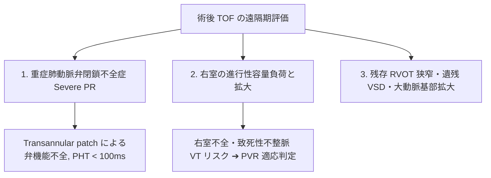

# ファロー四徴症 (TOF) 術後・成人期の評価

ファロー四徴症 (Tetralogy of Fallot: TOF) に対する根治術（VSDパッチ閉鎖＋右室流出路パッチ拡大術: Transannular Patch）を受けて成人期に達した患者 (ACHD) の遠隔期評価です。

---

## 1. TOF の基本4徴と根治術の解剖

```
【TOF の基本的4徴】
 1. 心室中隔欠損 (VSD)          2. 大動脈騎乗 (Overriding Aorta)
 3. 肺動脈弁/流出路狭窄 (PS/RVOT) 4. 右室肥大 (RVH)
```

小児期の根治術によりVSDはパッチ閉鎖され、RVOT狭窄は切開・パッチ拡大（Transannular Patch）されますが、これが成人期において**重大な遠隔期合併症**をもたらします。

---

## 2. 成人期 TOF 評価の3大チェックポイント



### 1) 重症肺動脈弁閉鎖不全症 (Severe PR) ★最大の課題
- **メカニズム**: パッチ拡大により肺動脈弁輪が破壊され、成長とともに極めて重度のPR（フリーのPR）が発生します。
- **エコー所見**:
  - カラードプラ: 肺動脈からRVOT全体に広がる広大な汎拡張期逆流ジェット。
  - CWドプラ: 逆流波形が順行性並みに濃く、拡張早期に急激に減衰。**$\text{PHT} < 100 \text{ ms}$**。

### 2) 右室の容量負荷と機能低下 (PVR適応の決定)
- 長期の Severe PR により、右室が著明に拡大（心尖部4腔で左室の1.5〜2倍以上）し、右室収縮能 (TAPSE, RV FAC) が低下します。
- **経皮的/手術的肺動脈弁置換術 (PVR: Pulmonary Valve Replacement)** のタイミングを逃すと右室機能が不可逆的になるため、定期的なエコーおよび心臓MRI (CMR) で右室容積・機能を追跡します。

### 3) その他のチェック項目
- **残存 RVOT 狭窄**: パッチ部の石灰化や変形による残存狭窄（CW Peak PG $\ge 36\text{mmHg}$）。
- **遺残 VSD**: パッチ閉鎖部周囲からの漏れ（カラードプラ短絡血流）。
- **大動脈基部拡大および AR**: 騎乗していた大動脈基部が成人期に拡大し、大動脈弁閉鎖不全 (AR) を合併することがあります。
