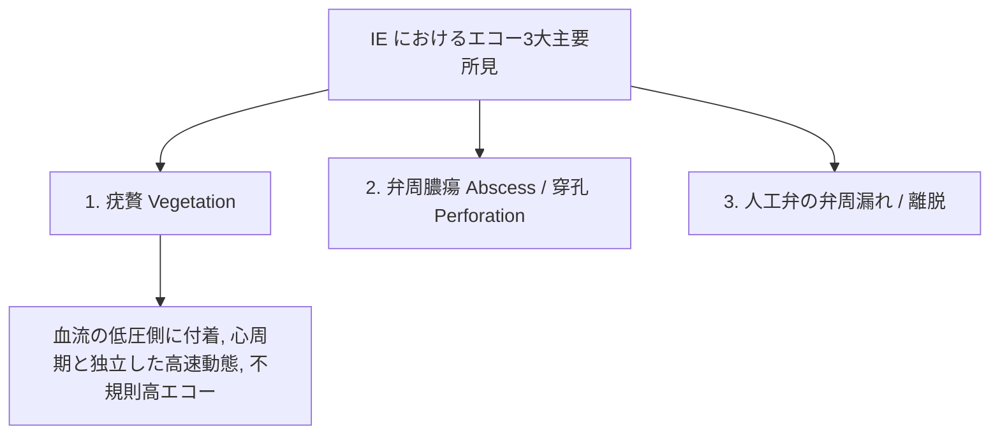

# 感染性心内膜炎 (IE) と疣贅 (Vegetation)

感染性心内膜炎 (Infective Endocarditis: IE) は、心内膜や弁に細菌等が感染し、弁破壊や全身性細菌性栓塞症を惹起する致命的疾患です。心エコーは Duke 診断基準におけるメジャー基準（大項目）を担います。

---

## 1. 疣贅 (Vegetation) のエコー所見

### 1) 疣贅の観察特徴
- **付着部位**: 通常、**弁の血流方向の低圧側（圧較差の出口側）** に付着します。
  - 僧帽弁 ➔ **左房側（閉鎖線付近）**
  - 大動脈弁 ➔ **左室流出路側**
- **エコー性状**: 不規則な形状の不均一な高エコー塊。
- **動態**: 心筋や弁の動きとは**独立した急速で規則性のないヒラヒラした揺れ (Rapid, independent motion)** を示します。

### 2) 弁破壊と合併症の評価
- **弁穿孔 (Perforation) / 腱索断裂**: 弁尖に穴が空き、急激な重症逆流 (Flail leaflet) を生じる。
- **弁周膿瘍 (Perivalvular Abscess)**: 弁輪周囲の心筋内に低〜エコーフリーのスペースを形成（大動脈弁輪部に好発）。房室ブロックを惹起。

---

## 2. 経胸壁 (TTE) vs 経食道 (TEE) の感度比較

> [!IMPORTANT]
> **IE 疑いにおける TEE の絶対的適応**
> - **TTE の感度**: $50 \sim 70\%$ （微小な $< 2 \sim 3\text{mm}$ の疣贅は見落とされる）。
> - **TEE の感度**: **$90 \sim 100\%$** （微小疣贅、弁周膿瘍、人工弁IEの確定診断に必須）。
> - **方針**: TTEで陰性であっても、臨床的にIEが強く疑われる場合は**直ちに TEE を施行することがガイドラインで強く推奨**されています。
