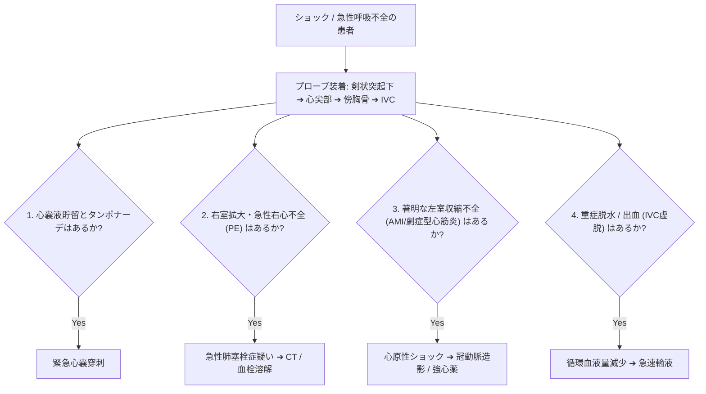

# 緊急エコー (POCUS / FATEプロトコル)

ショック（血圧低下）、呼吸困難、胸痛、または心停止を呈する致死的病態に対し、ベッドサイドで数分以内に「命に関わる4大原因」を否定・同定するプロトコルです。

---

## 1. FATE (Focus Assessed Transthoracic Echocardiography) プロトコル

心機能の細かい数値計算は後回しにし、治療介入に直結する**「4つの質問 (Yes/No)」** に答えます。

---

## 2. 4大致死的病態のエコー観察ポイント

### 1) 心タンポナーデ (Cardiac Tamponade)
- **観察**: 剣状突起下4腔断面。
- **サイン**: 心周囲の Echo-free space、**右房収縮末期虚脱 (RA Collapse)**、**右室拡張早期虚脱 (RV Collapse)**、IVC太く虚脱なし。

### 2) 急性右心負荷 / 肺血栓塞栓症 (PE: Pulmonary Embolism)
- **観察**: PSAX および AP4。
- **サイン**: **右室の著明拡大 ($RV > LV$)**、心室中隔の平坦化 (**D-shape**)、**McConnell sign**（右室心尖部運動は保たれるが自由壁が無動化）。

### 3) 著明な左室収縮不全 / 急性心筋梗塞 (AMI)
- **観察**: PLAX, PSAX, AP4。
- **サイン**: 目測で全周性または局所性に左室が全く動いていない（$\text{LVEF} < 20 \sim 30\%$）。

### 4) 循環血液量減少性ショック (Hypovolemic Shock)
- **観察**: 剣状突起下 IVC縦断像。
- **サイン**: **IVCがペラペラに崩壊虚脱**（径 $<10\text{mm}$、吸気時に完全にペシャンコ）。左室は虚脱状態で過収縮 (Hyperdynamic)。

---

## 3. POCUS 実施時の注意点

> [!WARNING]
> **確定診断にこだわりすぎない**
> POCUS/FATEの目的は詳細な計測ではなく「蘇生治療の方針決定」です。1つの断面が見えにくくても時間をかけず、すぐ次の断面（または胸膜エコーによる気胸除外など）へ移ることが鉄則です。
