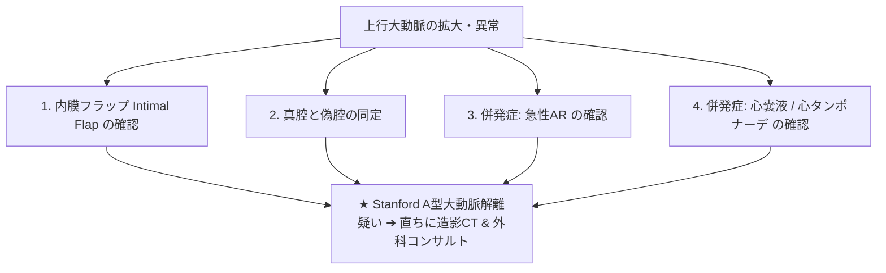

# 急性大動脈解離 (Stanford A型) と大動脈瘤

激痛（前胸部・背部痛）を主訴とする急性大動脈解離、特に上行大動脈に解離が及ぶ **Stanford A型** は、即座に外科的手術を要する極めて致死的な超緊急疾患です。

---

## 1. Stanford A型 大動脈解離のエコー診断サイン

胸痛患者に対し、傍胸骨左室長軸断面 (PLAX) や 胸骨上窩断面 から以下を素早く確認します。

### 1) 内膜フラップ (Intimal Flap)
- **Bモード所見**: 上行大動脈腔内に、大動脈壁と独立してヒラヒラと大きく揺れる膜状構造 (**Intimal flap**) を描出します。
- **偽像との鑑別**: 多重反射 (Reverberation) は血管壁と完全に平行に動くのに対し、本物のフラップは心周期（収縮期と拡張期）で動態が変化します。

### 2) 真腔 (True Lumen) と 偽腔 (False Lumen)
- **真腔**: 収縮期に拡大し、血流速度が速い（カラードプラで綺麗に染まる）。
- **偽腔**: 収縮期に圧縮され、血流が遅い（内部に自発陰影や血栓化を伴う）。

### 3) 2大致死性合併症
- **急性大動脈弁閉鎖不全症 (Acute AR)**: 解離が弁輪部に及び、弁尖の支持が失われて重症ARを来す。
- **心タンポナーデ (Cardiac Tamponade)**: 解離が大動脈基部から外膜側へ破裂・滲出し、心嚢液が急速貯留。

---

## 2. 大動脈瘤 (Aortic Aneurysm) の評価

- **上行大動脈瘤**: 径 **$> 45 \text{ mm}$** （$\ge 55\text{mm}$ で手術考慮）。
- **腹部大動脈瘤 (AAA)**: 腎動脈下に好発。最大短径 **$> 30 \text{ mm}$** （$\ge 50\text{mm}$ で破裂リスク急増）。内部の壁性血栓 (Mural thrombus) を観察します。
