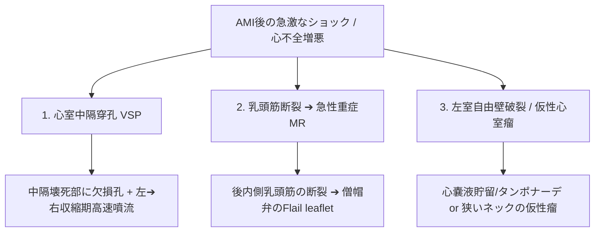
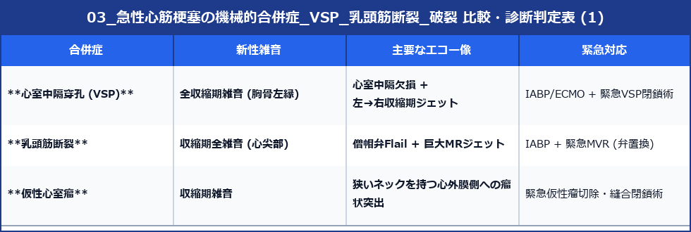

# 急性心筋梗塞の機械的合併症 (VSP, 乳頭筋断裂, 自由壁破裂)

急性心筋梗塞 (AMI) の発症後数日〜1週間以内に突如としてショックや心不全が増悪した場合、致命的な**機械的合併症 (Mechanical Complications)** を疑い、直ちに心エコーで鑑別します。

---

## 1. 3大機械的合併症の比較とエコー所見

### 1) 心室中隔穿孔 (VSP: Ventricular Septal Rupture)
- **好発**: 前壁梗塞（LAD）の中隔心尖部、または下壁梗塞（RCA）の中隔基部。
- **エコー所見**:
  - 壊死して薄くなった心室中隔内に欠損孔と連続性の不連続部を描出。
  - **カラードプラ**: 左室から右室へ吹き込む **収縮期高速モザイク血流 (L-R短絡)**。
  - **CWドプラ**: 左室圧と右室圧の圧較差に応じた高速波形。

### 2) 乳頭筋断裂 (Papillary Muscle Rupture)
- **好発**: 下壁梗塞に伴う **後内側乳頭筋 (Posteromedial PM)** の断裂（単一血流支配のため、双重支配の前外側乳頭筋より圧倒的に頻度が高い）。
- **エコー所見**:
  - 断裂した乳頭筋頭部が僧帽弁尖に付着したまま左房内へ反転飛び出す **Flail Leaflet**。
  - 左房内へ噴射する **急性極重症 MR ジェット**。

### 3) 左室自由壁破裂 (Free Wall Rupture) と 仮性心室瘤 (Pseudoaneurysm)
- **吹き出し型破裂 (Blow-out)**: 心室自由壁が全層破裂し、急速な心タンポナーデで即死を来す。
- **仮性心室瘤 (Pseudoaneurysm)**: 破裂部が心膜や血栓で偶然閉塞された状態。
  - **特徴**: **ネック（首）が狭く**、瘤の径が首より大きい（真性心室瘤は首が広い）。破裂リスクが極めて高いため**緊急手術適応**。

---

## 2. AMI機械的合併症の判定まとめ

