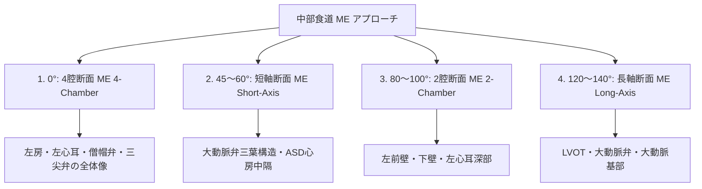

# 経食道心エコー (TEE) の基本手技と標準断面

経食道心エコー (Transesophageal Echocardiography: TEE) は、食道および胃内から心臓の裏側に直接高周波プローブをアプローチさせることで、胸壁や肺の障害を受けずに極めて高解像度の画像を得る検査法です。

---

## 1. TEE の適応と絶対的禁忌

### 1) 主な臨床適応
- **心源性脳栓塞症の検索**: **左心耳血栓 (LAA Thrombus)**、左房内もやもや血栓 (SEC)、卵円孔開存 (PFO)。
- **感染性心内膜炎 (IE)**: 微小な疣贅 ($<2\sim3\text{mm}$)、弁周膿瘍の診断。
- **弁膜症の手術前・術中評価**: 僧帽弁形成術 (Mitral repair) の弁尖解析、TAVI/SAVR 前評価。
- **心房中隔欠損症 (ASD)**: カテーテル閉鎖装置 (Amplatzer等) の適応判定とリム (Rim) の計測。
- **人工弁機能不全**: 人工弁周漏れ (PVL) や Pannus/血栓の鑑別。

### 2) 絶対的禁忌
- **食道穿孔、食道狭窄、食道がん、食道静脈瘤（出血既往）、食道憩室** など食道疾患。

---

## 2. マルチプレーン TEE の標準アプローチ角度

食道内の中部食道 (Mid-esophageal: ME) レベルにおいて、プローブ角度を $0^\circ \sim 180^\circ$ 電子回転させて観察します。

### 1) 左心耳 (LAA) の血流評価
- **方法**: ME $0^\circ \sim 135^\circ$ で左心耳を拡大し、PWドプラを左心耳口部から $1\text{cm}$ 奥に置きます。
- **左心耳流出速度 (LAA Flow Velocity)**:
  - 正常: $> 40 \text{ cm/s}$
  - **血栓形成高リスク (Af患者)**: **$< 20 \text{ cm/s}$** （もやもや血栓 SEC を伴う）

---

## 3. ASD カテーテル治療における TEE 評価リム (Rim)

ASD Closure の適応判定において、閉鎖栓を引っかける周囲のリム（壁の余白）が **$\ge 5 \text{ mm}$** あるかを計測します。

- **Aortic Rim (大動脈リム)**: ME $45^\circ$ で計測。
- **Superior/Inferior Vena Cava Rim (SVC/IVCリム)**: ME $90^\circ \sim 100^\circ$ (Bicaval view) で計測。
- **Atrioventricular Rim (房室弁リム)**: ME $0^\circ$ で計測。
