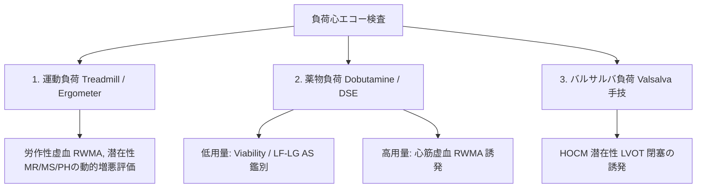

# 運動負荷・薬物負荷・バルサルバ負荷心エコーの実際

負荷心エコー図検査 (Stress Echocardiography) は、安静時には現れない虚血（RWMA）、潜在性弁膜症圧較差、心筋生存能 (Viability)、または閉塞性心筋症の流出路狭窄を誘発・評価する臨床検査です。

---

## 1. 3大負荷試験の目的と方法比較

---

## 2. ドブタミン薬物負荷心エコー (DSE: Dobutamine Stress Echo)

### 1) 低用量ドブタミン負荷 ($5 \sim 20 \mu\text{g/kg/min}$)
- **目的①: 心筋生存能 (Viability) の評価**
  - 無運動 (Akinesis) を呈する心筋梗塞領域が「単なる壊死（瘢痕）」か「生きている冬眠心筋 (Hibernating Myocardium)」かを判定。
  - **二相性反応 (Biphasic Response)**: 低用量で壁運動が改善し、高用量で再び悪化する所見がViabilityの最高精度サイン。
- **目的②: Low-Flow Low-Gradient AS の鑑別**
  - 真の重症ASか、単なる偽の重症AS (Pseudo-severe AS) かを鑑別します。

### 2) 高用量ドブタミン負荷 ($20 \sim 40 \mu\text{g/kg/min} + \text{Atropine}$)
- **目的**: 冠動脈狭窄による虚血性壁運動異常 (RWMA) の誘発。目標心拍数 (85% Age-predicted max HR) を目指します。

---

## 3. 運動負荷心エコー (Exercise Stress Echo)

- **方法**: 自転車エルゴメーター（仰臥位・傾斜型エルゴメーターが描出に最も有利）またはトレッドミル後直ちに描出。
- **適応と所見**:
  1. **無症候性重症 AS**: 運動により最高血流速度が著明上昇、または運動誘発性肺高血圧症を来すか。
  2. **弁膜症の動的評価**: 労作時に重症化する二重MRや肺高血圧症 (PASP $> 60\text{mmHg}$) の確認。

---

## 4. バルサルバ負荷心エコー (Valsalva Stress Echo) ★最新手引き2026

- **目的**: 潜在性閉塞性肥大型心筋症 (Labilly Obstructive HCM) における LVOT 閉塞の誘発。
- **手技**: 
  1. 患者に「大きく息を吸って、みぞおちに力を入れて10秒間強く力んでください」と指示。
  2. 力み中にLVOTにCWドプラを当て、**LVOT Peak PG $\ge 30 \text{ mmHg}$** （重症閉塞は $\ge 50\text{mmHg}$）への上昇および SAM の出現を確認。

---

## 5. 負荷心エコーの判定基準まとめ

| 負荷の種類 | 判定陽性サイン | 決定される治療方針 |
| :--- | :--- | :--- |
| **低用量 DSE (AS)** | SVが増加し $\text{AVA} < 1.0\text{cm}^2$ かつ $\text{Mean PG} \ge 40\text{mmHg}$ | **真の重症AS ➔ 手術/TAVI適応** |
| **低用量 DSE (Viability)** | 梗塞領域の壁運動が改善 (Biphasic response) | **血行再建術 (PCI/CABG) の適応** |
| **高用量 DSE (虚血)** | 負荷に伴い新たな局所壁運動異常 (RWMA) が出現 | **責任冠動脈病変の特定 ➔ PCI適応** |
| **バルサルバ負荷 (HCM)** | 力み中に SAM 出現 ＋ LVOT Peak PG $\ge 30 \text{ mmHg}$ | **閉塞性HCM (HOCM) 診断 ➔ 薬物/中隔消融** |
