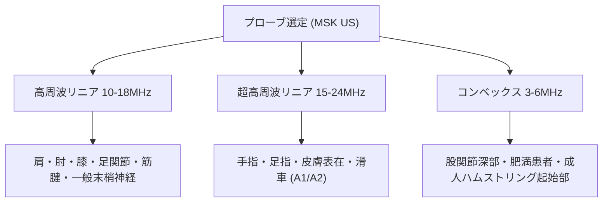

# 物理・プローブ選択・Knobology (運動器超音波)

> [!NOTE] 概要
> 運動器超音波（MSK US）において、高分解能画像を得るためのプローブ選定、周波数設定、Bモード・カラードプラ・パワードプラの調整手技（Knobology）を解説します。

---

## 1. 探触子（プローブ）の選定基準

運動器領域では、目的とする組織の深度（表在〜深部）に応じた周波数選定が不可欠です。

---

## 2. 装置調整（Knobology）の最適化

| 調整項目 | 推奨設定 | 臨床的意義・注意点 |
| :--- | :--- | :--- |
| **Depth（深度）** | 観察標的が画面中央〜下1/3に収まる深さ | 余分な深さを除外してフレームレート（FPS）を向上 |
| **Focus（フォーカス）** | 観察標的（腱・神経・靱帯）の深度に一致 | 分解能が最も高くなる点（ビームウエスト）に設定 |
| **Gain（ゲイン）** | 脂肪組織が適度な低エコーに見える感度 | 上げすぎはノイズ・異方性の誤認、下げすぎは描出不能 |
| **TGC** | 浅部から深部まで均一な輝度バランス | 表在腱の観察では浅部TGCをやや低めに調整 |
| **Color/Power Doppler** | PRF(流速): 500-1000Hz (低流速設定) | 炎症・腱炎に伴う微細血流（Neovascularization）を感度よく検出 |

---

## 3. 無圧走査とゼリーマウント法

表在構造物（正中神経、A1プーリー、ガングリオン等）の観察では、プローブの圧迫による血管潰滅や解剖学的変形を防ぐため、**ゼリーを厚く盛った無圧走査（Gel Mount Technique）**を実施します。