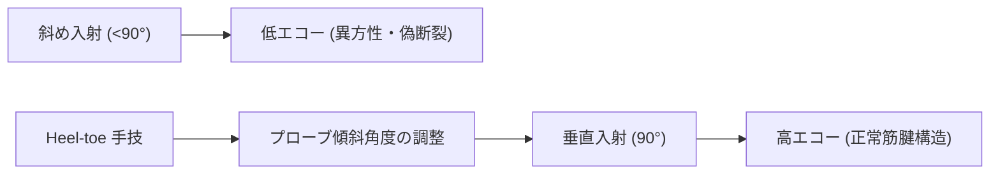

# 運動器US特有のアーチファクトと対処法

> [!IMPORTANT] 異方性（Anisotropy）の重要性
> 運動器超音波において最も頻出する偽像が**異方性（Anisotropy）**です。超音波が腱や靱帯に対して垂直に入射しない場合、エコーが反射して戻らず、正常な腱が低エコー（断裂様）に描出されます。

---

## 1. 異方性（Anisotropy）の物理原理と回避手技

### ヒールアンドトウ（Heel-toe）手技
プローブの一端（HeelまたはToe）を皮膚に強く押し当て、入射角を90°に微調整することで異方性を解消します。

---

## 2. 主なアーチファクト一覧と対処法

| アーチファクト | 特徴 | 主な発生部位 | 対処法 |
| :--- | :--- | :--- | :--- |
| **異方性 (Anisotropy)** | 超音波が斜めに入射すると低エコー化 | 腱板（SSP/ISP）、アキレス腱、膝蓋腱 | Heel-toe操作、Toggle操作 |
| **後方音響陰影 (Acoustic Shadowing)** | 骨表層・石灰化の後方が黒く抜ける | 骨皮質、石灰性腱炎、骨棘 | 石灰化の範囲確認・骨折線の同定に活用 |
| **多重反射 (Comet-tail / Reverberation)** | 金属針や強い反射体の後方に等間隔線 | USガイド下注射時の注射針 | 針の長軸描出（In-plane）で視認性を確保 |
| **エッジシャドウ (Edge Shadowing)** | 円形構造物の両端から発生する陰影 | 嚢胞（ガングリオン）、長頭腱（LHB） | 描出角度を変えて陰影裏の病変を確認 |