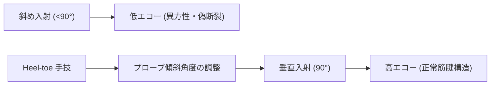
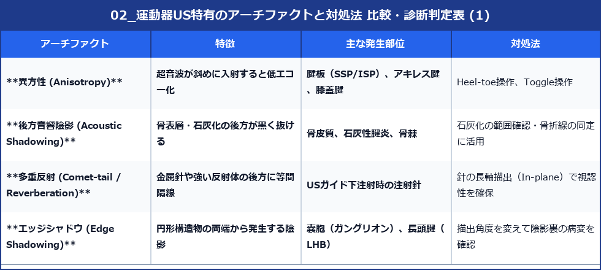

# 運動器US特有のアーチファクトと対処法

> [!IMPORTANT] 異方性（Anisotropy）の重要性
> 運動器超音波において最も頻出する偽像が**異方性（Anisotropy）**です。超音波が腱や靱帯に対して垂直に入射しない場合、エコーが反射して戻らず、正常な腱が低エコー（断裂様）に描出されます。

---

## 1. 異方性（Anisotropy）の物理原理と回避手技

### ヒールアンドトウ（Heel-toe）手技
プローブの一端（HeelまたはToe）を皮膚に強く押し当て、入射角を90°に微調整することで異方性を解消します。

---

## 2. 主なアーチファクト一覧と対処法

