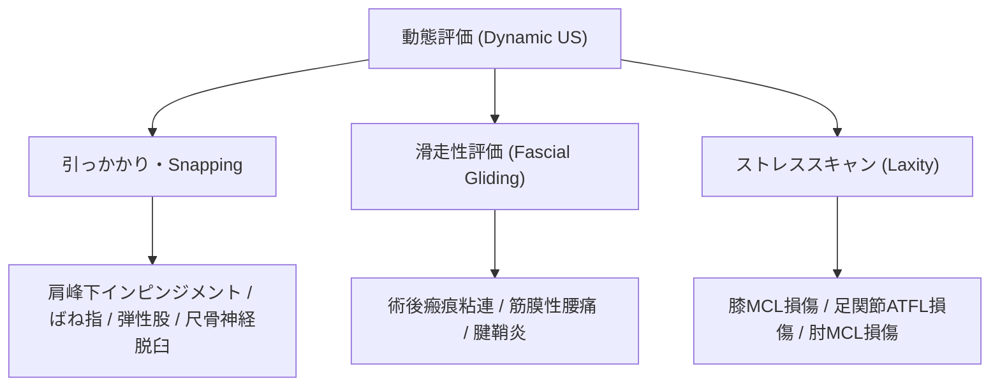

# 動態評価 (Dynamic US) と評価手法

> [!NOTE] Dynamic USの利点
> 超音波検査最大の強みは、リアルタイムで患者に関節運動や筋肉収縮を行わせながら観察できる**動態評価（Dynamic Ultrasound）**です。MRIやCTの静止画では捉えられない機能的異常を診断します。

---

## 1. 動態評価の臨床的適応フロー

---

## 2. 代表的な動態テスト手技

| 疾患・部位 | 動態評価の手順 | 異常所見 |
| :--- | :--- | :--- |
| **肩峰下インピンジメント** | 肩関節外転運動に伴う肩峰下での棘上筋腱・SASBの通過観察 | SASBの引っかかり、滑液包の肩峰下での座屈・集積 |
| **ばね指（A1プーリー）** | 指の自動屈伸運動を長軸・短軸で描出 | A1プーリー入口部での屈筋腱の結節状膨大と引っかかり現象 |
| **肘管症候群（尺骨神経脱臼）** | 肘関節の自動最大屈曲運動 | 尺骨神経が内側上顆を乗り越えて前方に脱臼・亜脱臼 |
| **足関節ATFL損傷** | 前方引き出しストレス（Anterior Drawer Test）の同時描出 | 距骨-腓骨間の関節隙の異常開大（>3mm左右差） |