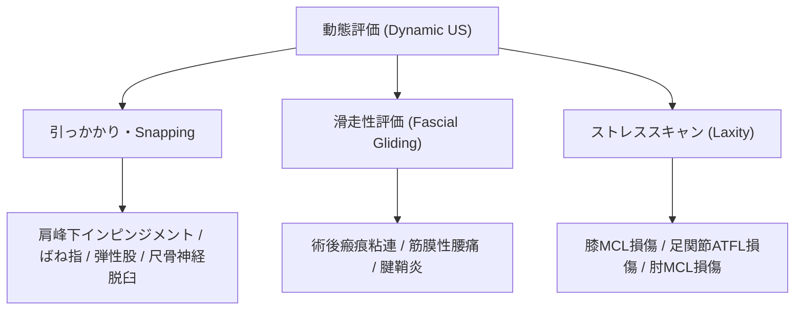

# 動態評価 (Dynamic US) と評価手法

> [!NOTE] Dynamic USの利点
> 超音波検査最大の強みは、リアルタイムで患者に関節運動や筋肉収縮を行わせながら観察できる**動態評価（Dynamic Ultrasound）**です。MRIやCTの静止画では捉えられない機能的異常を診断します。

---

## 1. 動態評価の臨床的適応フロー

---

## 2. 代表的な動態テスト手技

