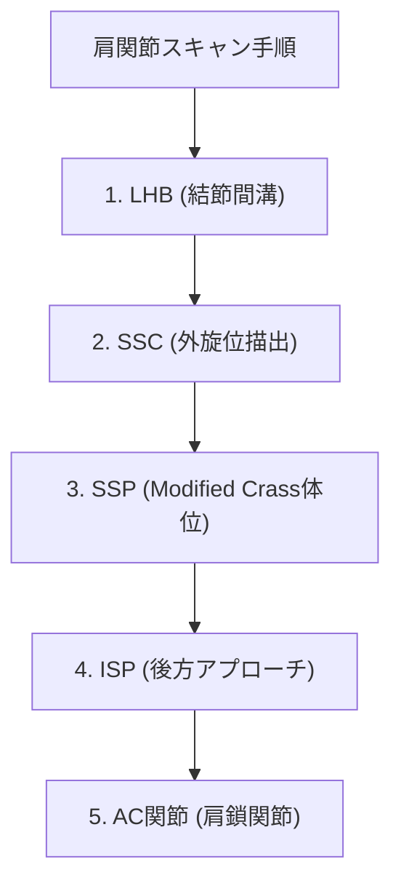

# 肩関節：解剖と標準描出

> [!NOTE] 走査手順の基本
> 肩関節超音波検査は、LHB（上腕二頭筋長頭腱）→ SSC（肩甲下筋腱）→ SSP（棘上筋腱）→ ISP（棘下筋腱）→ AC関節の順序で系統的に行います。

---

## 1. 肩関節標準描出スクリーニングフロー

```mermaid
flowchart TD
    A["肩関節スキャン手順"] --> B["1. LHB (結節間溝)"]
    B --> C["2. SSC (外旋位描出)"]
    C --> D["3. SSP (Modified Crass体位)"]
    D --> E["4. ISP (後方アプローチ)"]
    E --> F["5. AC関節 (肩鎖関節)"]
```

---

## 2. 構造物別の観察ポイントと体位

