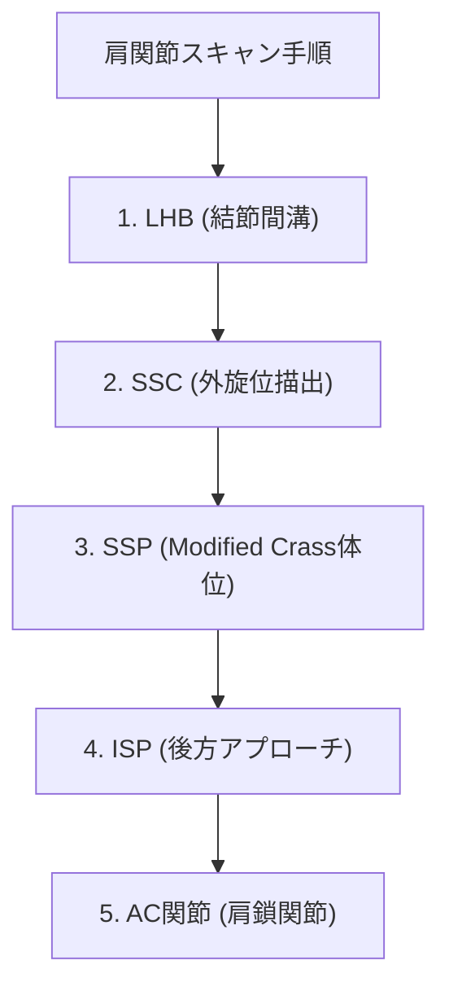

# 肩関節：解剖と標準描出

> [!NOTE] 走査手順の基本
> 肩関節超音波検査は、LHB（上腕二頭筋長頭腱）→ SSC（肩甲下筋腱）→ SSP（棘上筋腱）→ ISP（棘下筋腱）→ AC関節の順序で系統的に行います。

---

## 1. 肩関節標準描出スクリーニングフロー

---

## 2. 構造物別の観察ポイントと体位

| 観察標的 | 患側体位・姿勢 | アプローチ・描出位置 | 正常エコー像 |
| :--- | :--- | :--- | :--- |
| **LHB (長頭腱)** | 肘屈曲90°・前腕回外位 | 結節間溝（短軸・長軸） | 大結節と小結節の間で高エコー楕円形 |
| **SSC (肩甲下筋腱)** | 肘屈曲90°・肩関節最大外旋 | 小結節への付着部（長軸・短軸） | 扇状の高エコー線維構造 |
| **SSP (棘上筋腱)** | Modified Crass（手を後上棘に置く） | 大結節上端（Bird's beak像） | 鳥の嘴（Bird's beak）様の均一な高エコー |
| **ISP (棘下筋腱)** | 手を反対側の肩に置く | 棘下腔・後方関節唇 | 関節唇から大結節後方に走る高エコー |
| **AC (肩鎖関節)** | ニュートラル体位 | 肩峰と鎖骨遠位端の境界 | 骨性の階段状不連続と関節包 |