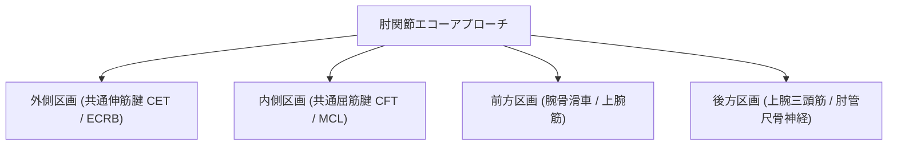
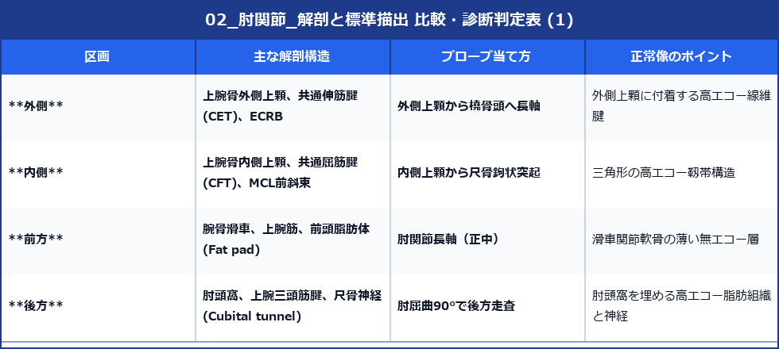

# 肘関節：解剖と標準描出

> [!NOTE] 概要
> 肘関節は外側（テニス肘）、内側（ゴルフ肘・MCL）、前頭（関節包・Fat pad）、後頭（肘頭・尺骨神経）の4アプローチで評価します。

---

## 1. 肘関節4区画アプローチ

```mermaid
flowchart TD
    A["肘関節エコーアプローチ"] --> B["外側区画 (共通伸筋腱 CET / ECRB)"]
    A --> C["内側区画 (共通屈筋腱 CFT / MCL)"]
    A --> D["前方区画 (腕骨滑車 / 上腕筋)"]
    A --> E["後方区画 (上腕三頭筋 / 肘管尺骨神経)"]
```

---

## 2. 主要アプローチの解剖標的

