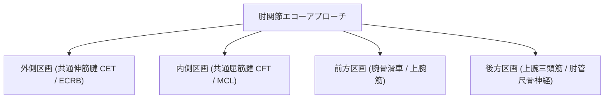

# 肘関節：解剖と標準描出

> [!NOTE] 概要
> 肘関節は外側（テニス肘）、内側（ゴルフ肘・MCL）、前頭（関節包・Fat pad）、後頭（肘頭・尺骨神経）の4アプローチで評価します。

---

## 1. 肘関節4区画アプローチ

---

## 2. 主要アプローチの解剖標的

| 区画 | 主な解剖構造 | プローブ当て方 | 正常像のポイント |
| :--- | :--- | :--- | :--- |
| **外側** | 上腕骨外側上顆、共通伸筋腱 (CET)、ECRB | 外側上顆から橈骨頭へ長軸 | 外側上顆に付着する高エコー線維腱 |
| **内側** | 上腕骨内側上顆、共通屈筋腱 (CFT)、MCL前斜束 | 内側上顆から尺骨鉤状突起 | 三角形の高エコー靱帯構造 |
| **前方** | 腕骨滑車、上腕筋、前頭脂肪体 (Fat pad) | 肘関節長軸（正中） | 滑車関節軟骨の薄い無エコー層 |
| **後方** | 肘頭窩、上腕三頭筋腱、尺骨神経 (Cubital tunnel) | 肘屈曲90°で後方走査 | 肘頭窩を埋める高エコー脂肪組織と神経 |