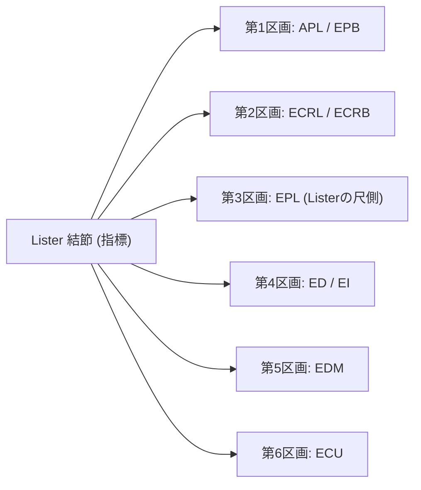

# 手関節・手指：解剖と標準描出

> [!NOTE] 背側1〜6区画の走査
> 手関節背側は Lister結節を基準として、第1〜第6伸筋支帯区画（Compartments）を系統的に描出します。

---

## 1. 手関節背側 伸筋支帯区画 (Compartments 1-6)

---

## 2. 掌側および手指の解剖標的

| 領域 | 描出標的 | プローブ操作・指標 | 臨床的注目点 |
| :--- | :--- | :--- | :--- |
| **掌側** | 正中神経、屈筋腱 (FDS/FDP)、屈筋支帯 | 豆状骨-舟状骨結節レベル短軸 | 正中神経の蜂の巣状（Honey-comb）パターン |
| **手指掌側** | A1 / A2 プーリー、深・浅指屈筋腱 | MP関節〜PIP関節長軸・短軸 | 屈筋腱を保持する極薄い高エコーバンド |
| **尺側** | TFCC (三角線維軟骨複合体) | 尺骨茎状突起-月状骨/三角骨間 | 均一な高エコー三角軟骨と無エコー関節腔 |