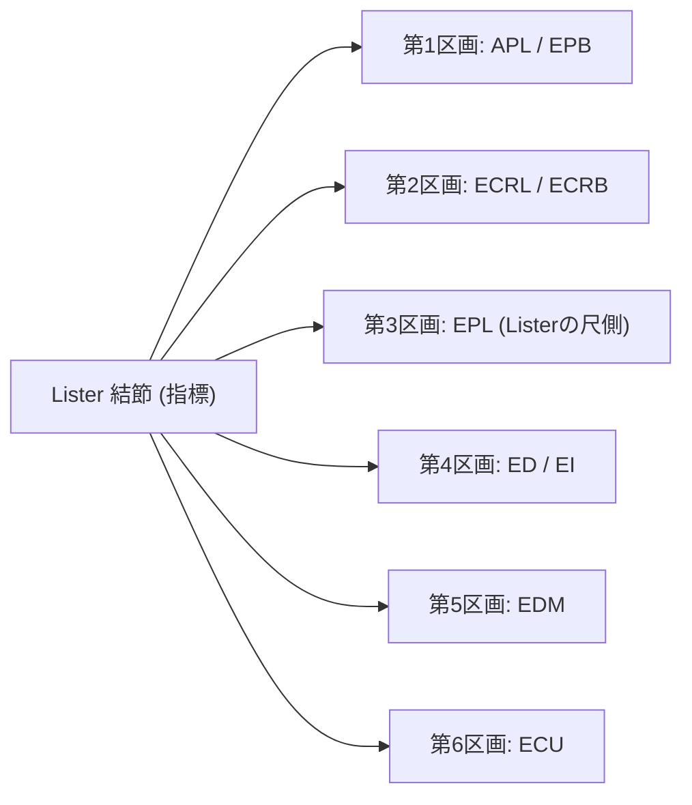

# 手関節・手指：解剖と標準描出

> [!NOTE] 背側1〜6区画の走査
> 手関節背側は Lister結節を基準として、第1〜第6伸筋支帯区画（Compartments）を系統的に描出します。

---

## 1. 手関節背側 伸筋支帯区画 (Compartments 1-6)

```mermaid
flowchart LR
    A["Lister 結節 (指標)"] --> B["第1区画: APL / EPB"]
    A --> C["第2区画: ECRL / ECRB"]
    A --> D["第3区画: EPL (Listerの尺側)"]
    A --> E["第4区画: ED / EI"]
    A --> F["第5区画: EDM"]
    A --> G["第6区画: ECU"]
```

---

## 2. 掌側および手指の解剖標的

