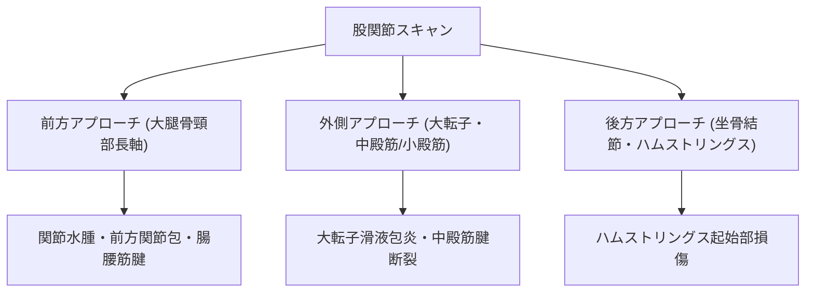

# 股関節・鼠径部：解剖と標準描出

> [!NOTE] 概要
> 股関節は深部構造のため、必要に応じて3〜6MHzのコンベックスプローブまたは深部用リニアプローブを使用します。

---

## 1. 股関節スキャン領域

---

## 2. 前方関節包の標準描出

- **体位**: 仰臥位、股関節軽度外旋位。
- **指標**: 大腿骨頭-頸部長軸像を平行に描出。
- **正常所見**: 前方関節包（Anterior Capsular Distance）は通常 **7mm未満**。