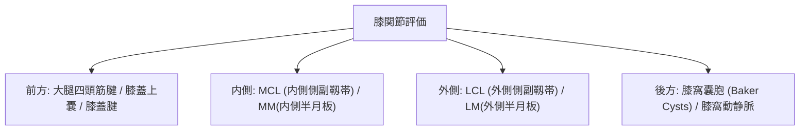

# 膝関節：解剖と標準描出

> [!NOTE] 走査の4基本区画
> 膝関節は、前方（膝蓋上嚢・膝蓋腱）、内側（MCL・内側半月板）、外側（LCL・外側半月板）、後方（膝窩・Popliteal fossa）の4区画で評価します。

---

## 1. 膝関節4区画マッピング

---

## 2. 各区画の描出テクニック

| 区画 | 主な構造物 | 体位・アプローチ | 正常エコー像 |
| :--- | :--- | :--- | :--- |
| **前方** | 膝蓋上嚢 (Suprapatellar recess)、膝蓋腱 | 膝屈曲30°、長軸像 | 膝蓋骨上極の無エコー recess、膝蓋腱の層状高エコー |
| **内側** | MCL (浅層/深層)、内側半月板 (MM) | 膝屈曲30°、内側関節隙長軸 | ２層の高エコー靱帯と、関節隙に挟まれる三角形半月板 |
| **外側** | LCL、腸脛束 (ITB)、外側半月板 (LM) | 膝屈曲90° (Figure-4体位) | 大腿骨外側上顆から腓骨頭に伸びる索状高エコー |
| **後方** | Baker嚢胞、半膜様筋-腓腹筋内側頭滑液包 | 腹臥位・膝完全伸展位 | 腓腹筋内側頭と半膜様筋腱の間の首（Neck）構造 |