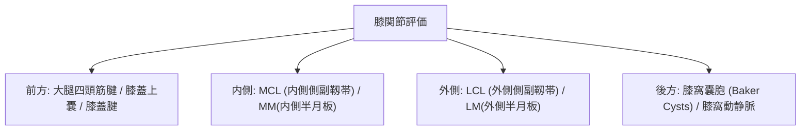
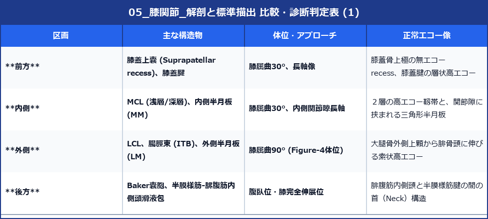

# 膝関節：解剖と標準描出

> [!NOTE] 走査の4基本区画
> 膝関節は、前方（膝蓋上嚢・膝蓋腱）、内側（MCL・内側半月板）、外側（LCL・外側半月板）、後方（膝窩・Popliteal fossa）の4区画で評価します。

---

## 1. 膝関節4区画マッピング

```mermaid
flowchart TD
    A["膝関節評価"] --> B["前方: 大腿四頭筋腱 / 膝蓋上嚢 / 膝蓋腱"]
    A --> C["内側: MCL (内側側副靱帯) / MM(内側半月板)"]
    A --> D["外側: LCL (外側側副靱帯) / LM(外側半月板)"]
    A --> E["後方: 膝窩嚢胞 (Baker Cysts) / 膝窩動静脈"]
```

---

## 2. 各区画の描出テクニック

