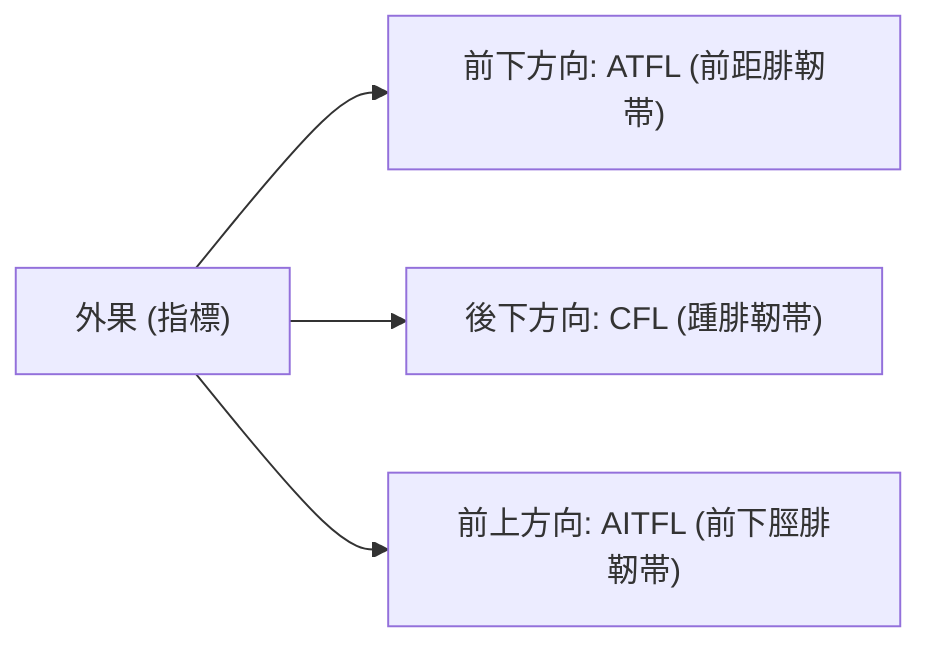

# 足関節・足部：解剖と標準描出

> [!NOTE] 概要
> 外傷で最も頻度の高いATFL（前距腓靭帯）から、アキレス腱・足底腱膜までを体系的に描出します。

---

## 1. 足関節外側靭帯群の描出フロー

---

## 2. 主要標的の描出手技

| 標的構造 | アプローチ | 体位 | 正常所見 |
| :--- | :--- | :--- | :--- |
| **ATFL (前距腓靭帯)** | 外果前下端から距骨頭へ | 底屈・内反位 | 外果と距骨を結ぶピンと張った高エコー帯 |
| **CFL (踵腓靭帯)** | 外果下端から踵骨外側へ | 背屈位（長肢位） | 腓骨筋腱の深層を走る索状高エコー |
| **アキレス腱** | 踵骨付着部から上方15cm長軸・短軸 | 腹臥位・足部台外固定 | 厚さ4-5mmの明瞭な高エコー腱構造 |
| **足底腱膜** | 踵骨隆起付着部長軸 | 腹臥位・足指背屈位 | 踵骨付着部で厚さ4mm未満の層状構造 |