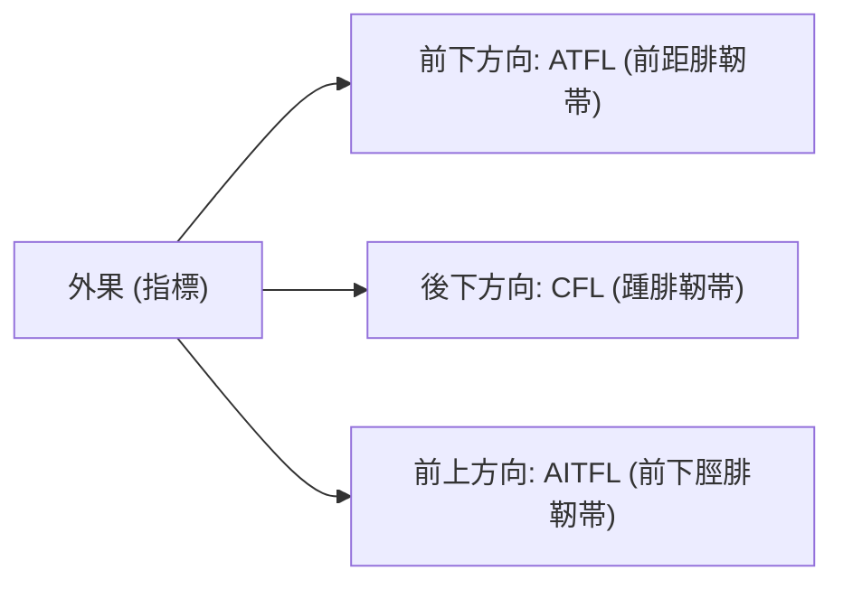

# 足関節・足部：解剖と標準描出

> [!NOTE] 概要
> 外傷で最も頻度の高いATFL（前距腓靭帯）から、アキレス腱・足底腱膜までを体系的に描出します。

---

## 1. 足関節外側靭帯群の描出フロー

```mermaid
flowchart LR
    A["外果 (指標)"] --> B["前下方向: ATFL (前距腓靭帯)"]
    A --> C["後下方向: CFL (踵腓靭帯)"]
    A --> D["前上方向: AITFL (前下脛腓靭帯)"]
```

---

## 2. 主要標的の描出手技

