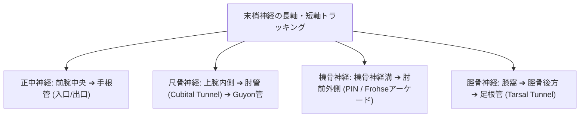
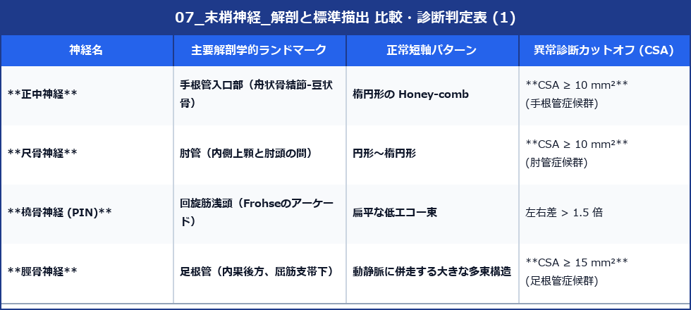

# 末梢神経：解剖と標準描出

> [!IMPORTANT] 神経描出のゴールデンルール
> 運動器超音波における末梢神経の短軸像は、**「蜂の巣状パターン（Honey-comb Appearance）」**（低エコーの神経束が、高エコーの外神経膜に囲まれた構造）として同定します。

---

## 1. 主要末梢神経のトラッキングマップ

---

## 2. 神経別の解剖指標とカットオフ断面積 (CSA)

