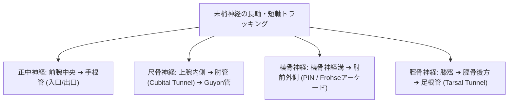

# 末梢神経：解剖と標準描出

> [!IMPORTANT] 神経描出のゴールデンルール
> 運動器超音波における末梢神経の短軸像は、**「蜂の巣状パターン（Honey-comb Appearance）」**（低エコーの神経束が、高エコーの外神経膜に囲まれた構造）として同定します。

---

## 1. 主要末梢神経のトラッキングマップ

---

## 2. 神経別の解剖指標とカットオフ断面積 (CSA)

| 神経名 | 主要解剖学的ランドマーク | 正常短軸パターン | 異常診断カットオフ (CSA) |
| :--- | :--- | :--- | :--- |
| **正中神経** | 手根管入口部（舟状骨結節-豆状骨） | 楕円形の Honey-comb | **CSA ≥ 10 mm²** (手根管症候群) |
| **尺骨神経** | 肘管（内側上顆と肘頭の間） | 円形〜楕円形 | **CSA ≥ 10 mm²** (肘管症候群) |
| **橈骨神経 (PIN)** | 回旋筋浅頭（Frohseのアーケード） | 扁平な低エコー束 | 左右差 > 1.5 倍 |
| **脛骨神経** | 足根管（内果後方、屈筋支帯下） | 動静脈に併走する大きな多束構造 | **CSA ≥ 15 mm²** (足根管症候群) |