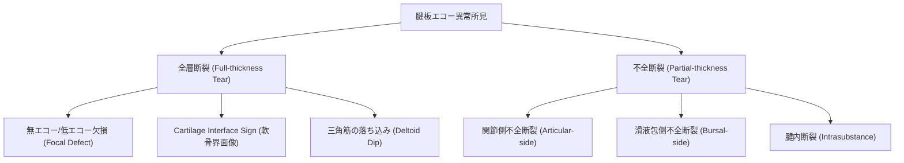
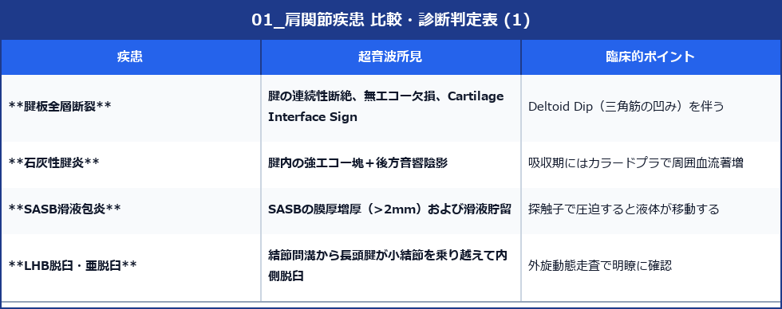

# 肩関節疾患の超音波所見

> [!NOTE] 概要
> 肩関節領域の主要病変（腱板断裂、石灰性腱炎、肩峰下インピンジメント、LHB病変）の超音波診断基準を解説します。

---

## 1. 腱板断裂（Full-thickness / Partial-thickness）の診断基準

```mermaid
flowchart TD
    A["腱板エコー異常所見"] --> B["全層断裂 (Full-thickness Tear)"]
    A --> C["不全断裂 (Partial-thickness Tear)"]

    B --> B1["無エコー/低エコー欠損 (Focal Defect)"]
    B --> B2["Cartilage Interface Sign (軟骨界面像)"]
    B --> B3["三角筋の落ち込み (Deltoid Dip)"]

    C --> C1["関節側不全断裂 (Articular-side)"]
    C --> C2["滑液包側不全断裂 (Bursal-side)"]
    C --> C3["腱内断裂 (Intrasubstance)"]
```

---

## 2. 疾患別エコー所見まとめ

