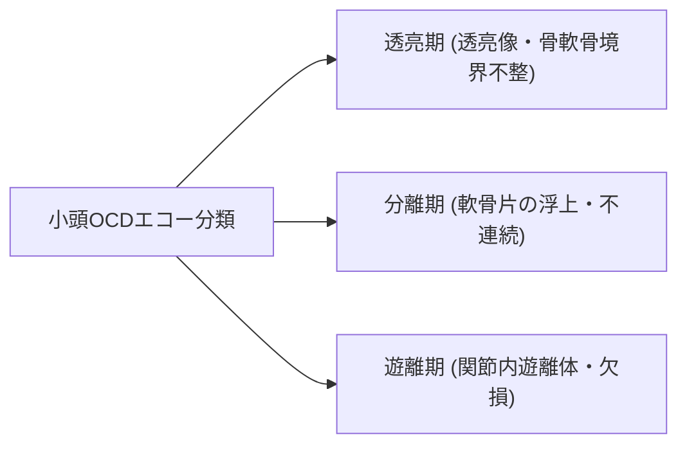

# 肘関節疾患の超音波所見

> [!NOTE] 概要
> 上腕骨外側上顆炎（テニス肘）、内側上顆炎（ゴルフ肘）、MCL損傷、および野球肘（OCD）の所見をまとめます。

---

## 1. 上腕骨外側上顆炎（テニス肘）の所見

- **共通伸筋腱（CET / ECRB）の肥厚と低エコー化**
- **腱付着部の微細石灰化・骨棘形成**
- **パワードプラでのNeovascularization（新生血流）**

---

## 2. 小頭離断性骨軟骨炎（OCD）の水野分類エコー像

