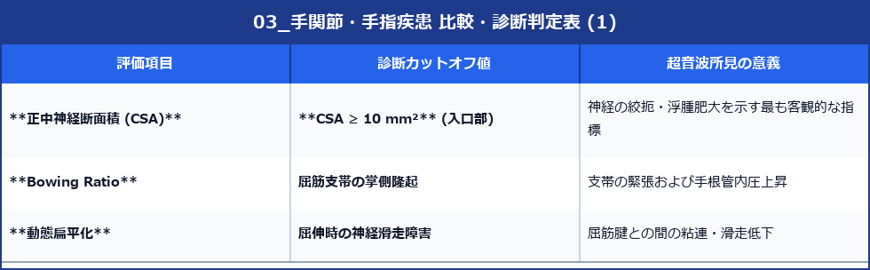

# 手関節・手指疾患の超音波所見

> [!NOTE] 概要
> ばね指、De Quervain病、手根管症候群、ガングリオンの超音波診断基準を記載します。

---

## 1. 手根管症候群（CTS）の定量的エコー診断

---

## 2. ばね指・De Quervain病・ガングリオンの所見

- **ばね指**: A1プーリーの肥厚（>1mm）と屈筋腱の結節状低エコー肥厚。自動屈伸時の引っかかり。
- **De Quervain病**: 第1区画（APL/EPB）の腱鞘肥厚と滑液貯留、隔壁（Septum）の有無の評価。
- **ガングリオン**: 境界明瞭な無エコー〜低エコー嚢胞、後方エコー増強、関節・腱鞘へ伸びる**茎（Stalk）**の同定。